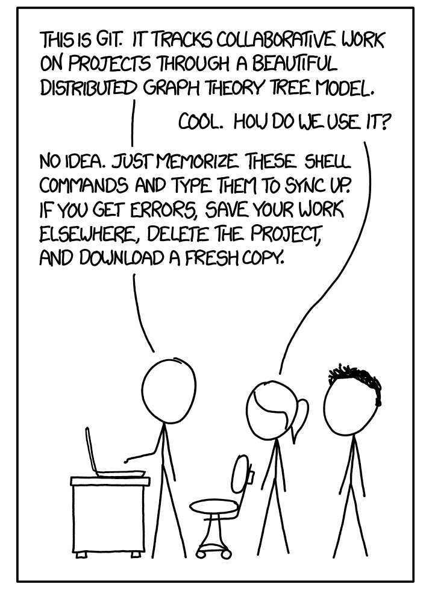

# Syllabus

## Course info
__Instructor__:  
Daniel McDonald  
Office: Harper Center 359
Website: http://mypage.iu.edu/~dajmcdon  
Email: daniel.mcdonald@chicagobooth.edu

__Office hours__:  
Me: Tuesday 11-12:30, by appointment

__Course webpage__:    
WWW: https://booth41911.github.io/  
Github: https://github.com/booth41911  
Piazza: https://piazza.com/chicagobooth/fall2018/bus41911/home  
Piazza sign-up: https://piazza.com/chicagobooth/fall2018/bus41911

__Lectures__:  
Tuesday 2-5pm, Harper Center Seminar Room 3SW

__Textbook__:  
Required: ESL = [_Elements of Statistical Learning_](https://web.stanford.edu/~hastie/ElemStatLearn/)  

__Prerequisite__:  
Ph.D.-level course(s) in mathematical statistics and econometrics at the level of Business 41901, 41902, 41903 or Economics 31000-31200.

## Course objectives

Topics: 
1. Data analysis workflow;  
2. Supervised learning;   
3. Model selection;   
4. Dimension reduction;  
5. Graphical Models/Time series/Causal inference if time allows.  

Applications from finanace/macro/marketing as best I can.

Emphasis on developing a workflow to avoid mistakes.

## Lectures

Class time will consist of a
combination of lecture, discussion, questions and answers, and problem
solving, with a focus on problem solving. You are strongly encouraged
to bring a laptop to class.

## Textbook

The required textbook for this class is the standard for ML at this level. 
It is excellent and free electronically. 

There are some extra suggested materials (especially for this week). They are linked on the website.

If you find additional resources, let me know! I'll link them.

## Course communication

We'll use Piazza. (Seems common to Booth?)

Try to constrain communication to Piazza.


## Grading

* First class pre-test, 5% (completion)
* Participation on in-class exercises and Piazza, 15%
* Group/individual homework (3-4 exercises), 20%
* Take-home midterm exam, 25%
* Course project, 10% (PC1), 25% (PC2)


## In-class exercises

We will regularly have short programming or theoretical exercises during class time. 


## Homeworks

* All assignments will be submitted on Github. 
* Homework grades
will be awarded based on complete and accurate analyses according to the rubric provided with each assignment.
* Note that the submission repo is __public__ (to the class)

## Project

* You will be required to complete a project (1-3 people). 
* You may choose this group. 
* The goal is to analyze a dataset in depth using anything that you have learned. 
* See the [project](https://booth41911.github.io/project.html) page for detailed requirements.
* This is a PhD course.

The entire class will give brief presentations during the last week of classes. 


## Exams

* One take-home exam to be completed entirely individually. 
* The midterm will be made available by __Thursday, October 25__ 
* Submission by __Thursday, November 1__ at 11:59pm.

> If either of these dates pose some type of problem, you must notify me no later than Friday, September 28. After this date, no alternatives will be considered without medical documentation.


## Solutions

* Some of the problems that are assigned are similar or identical to those assigned in previous years
by me or other instructors for this or other courses. 
* Using proofs or
code from anywhere other than the textbooks (with attribution), this
year's course notes (with attribution), or the course website is not
only considered cheating 
(as described above), it is easily detectable cheating. 


## Cheating

(Things I hope I don't have to say.)

* In previous years, I have caught students cheating on exams. 
* Cheating, in my experience, occurs because students don't understand the material, so the result is usually a failing grade even before I impose any penalty and report the incident to the Dean's office. 
* I carefully structure exams to make it so that I can catch these issues. 
* I ~~will~~ catch you, and it does not help. 
* If you are struggling, I want to help.

> If I suspect cheating, your case will be forwarded to the Dean's office. No questions asked.

# Github

## Acknowledgements

* Much of this lecture is borrowed/stolen from Colin Rundel and Karl Broman


## Why version control?

<p align=center>

</p>

## Why version control?

* Simple formal system for tracking all changes to a project
* Time machine for your projects
    + Track blame and/or praise
    + Remove the fear of breaking things
* Learning curve is steep, but when you need it you REALLY need it

> Your closest collaborator is you six months ago, but you don’t reply to emails.
> -- _Paul Wilson_

## Why Git

* You could use something like Box or Dropbox
* These are poor-man's version control
* Git is much more appropriate
* It works with large groups
* It's very fast
* It's much better at fixing mistakes
* Tech companies use it (so it's in your interest to have some experience)

> This will hurt, but what doesn't kill you, makes you stronger.

## Why part 2

* As a student, I didn't know anything about git/github.
* No one taught me how to use it.
* As a Professor who collaborates a lot, I find it indispensible.
* I had to learn it on my own, and I still have trouble.
* If I make you do it, you'll be better off than I was.

__JMLR vs. dajmcdon/dpf__

## Set up

* Open Rstudio
* Go to the "Tools" menu and select "Shell"
* Type 

```
git --version
```

* If it's there, you're done.
* For detailed install instructions, or to be more choosy in the version you get, see [Happy git with R](http://happygitwithr.com/install-git.html)

## (Hard way, Windows)

* Install [Git for Windows](https://git-for-windows.github.io/), also known as `msysgit` or "Git Bash", 
*  **NOTE:** Select "Use Git from the Windows Command Prompt" during installation. Otherwise, we believe it's OK to accept the defaults.
* Note that RStudio for Windows prefers for Git to be installed below `C:/Program Files`, often at `C:/Program Files/Git/bin/git.exe`. 


## (Hard way, Mac)

Install the Xcode command line tools (**not all of Xcode**), which includes Git. If your OS is older than 10.11 El Capitan, it is possible that you **must** install the Xcode command line tools in order for RStudio to find and use Git.

Go to the shell and enter one of these commands to elicit an offer to install developer command line tools:

``` bash
git --version
git config
```

Accept the offer! Click on "Install".

## (Hard way, Linux)

Install Git via your distro's package manager.

Ubuntu or Debian Linux:

```sh
sudo apt-get install git
```

Fedora or RedHat Linux:

```sh
sudo yum install git
```

## Pause for actions

<p align=center>

</p>

## Initial configuration

* Now tell it who your are:

```
$ git config --global user.name "Daniel McDonald"
$ git config --global user.email "dajmcdon@gmail.com"
$ git config --global core.editor nano
```

* `nano` is a light-weight text editor. You probably won't ever use it, but it's good to tell
git to use nano. If for some reason git asks you questions about doing things, just remember

> Ctrl + X is quit

(it says this at the bottom of the window)

* This is all that we will do with git in the terminal
* Rstudio has git built in, and so we'll use it through there mostly
* Using the terminal gives access to more complicated issues, which hopefully we won't have to deal with.

## Github

* This is a commercial site that interacts with Git (GitLab and Bitbucket do as well)
* You need a free account http://www.github.com/ (get the Education one)
* Git tracks changes to your files in both places
* Your files live in __repositories__ (repos in the lingo)
* You and others share access to repos

## When you want to work on a file

* You __pull__ the repo onto your local machine
* Make all your changes, saving as many times as you like.
* You __commit__ your changes with a message, e.g.: "I fixed the horrible bug"
* You __push__ your changes back to the repo

## Syncing up with Rstudio

Demonstration:

1. Preferences > Git/svn 
2. If there is a key there, and you know when you made it/how to use it, skip to 4.
3. If empty, "Create"
4. "View public key", copy.
5. Github.com > Profile photo > Settings > SSH and GPG key > New SSH
6. Paste

Now you don't need your passphrase (from this computer)

## In class practice

* Go to https://github.com/booth41911/class-roster/
* Clone or download.
* Rstudio > New Project > Version Control > Git 
* Add your information to the table. 
* Save.
* Stage (click the box). Commit (add message).
* __Pull__
* Fix issues.
* Push


# R/Rmarkdown

## Mark Up, Markdown

* You are probably used to word processing programs, like Microsoft Word, which
employ the "what you see is what you get" (WYSIWYG) principle: 
  - you want italics, click, and, lo, they're in italics 
  - you want some to be in a bigger, different font and you just select
the font, and so on.  

* This works well enough for n00bs but is not a viable
basis for a system of text formatting

* because it depends on a particular
program (a) knowing what you mean and (b) implementing it well.  

* The essential idea in a __mark-up language__ is that it consists of ordinary text, _plus_ signs which indicate
how to change the formatting or meaning of the text.  

* Some mark-up languages,
like HTML (Hyper-Text Markup Language) use very obtrusive markup; others,
like the language called __Markdown__, are more subtle.  


## Example 

For instance, the
last few sentences in Markdown look like this:

```
* The essential idea in a
__mark-up language__ is that it consists of ordinary text, _plus_ signs which
indicate how to change the formatting or meaning of the text.  

* Some mark-up
languages, like HTML (Hyper-Text Markup Language) use very obtrusive markup;
others, like the language called __Markdown__, are more subtle.
```


## Rendering 

* Every mark-up language needs to be __rendered__ somehow into a format which
actually includes the fancy formatting, images, mathematics, computer code,
etc., etc., specified by the mark-up.  

* For HTML, the rendering program is
called a "web browser".  

* Most computers which know how to work with Markdown
at all know how to render it as 
    - HTML (which you can then view in a browser),
    - PDF (uses LaTeX, which you can then view in Acrobat or the like), 
    - Word (which you can
then view in the abomination of Redmond).


## Advantages

* portability across machines
* no proprietary software (I'm looking at you Bill)
* stability 

R Markdown is, in
particular, both "free as in beer" (you will never pay a dollar for software to
use it) and "free as in speech" (the specification is completely open to all to
inspect).  

Even if you are completely OK with making obeisance to the
Abomination of Redmond every time you want to read your own words, the sheer
stability of mark-up languages makes them superior for scientific documents.

## Rendering and Editing

To write R Markdown, you will need a text editor, a program which lets you read
and write plain text files.  You will also need R, and the package `rmarkdown`
(and all the packages it depends on).

* Most computers come with a text editor (TextEdit on the Mac, Notepad on Windows machines, etc.).
* There are also lots of higher-powered text editors; I use [Emacs](http://www.gnu.org/software/emacs/emacs.html), but I admit it has a harsh learning curve.
* You _could_ use Word (or some other WYSIWYG word processor), taking care to always save your document in plain text format.  I do not recommend this.
* [R Studio](http://www.rstudio.com) comes with a built-in text editor, which knows about, and has lots of tools for, working with R Markdown documents.

If this is your first time using a text editor for something serious, I recommend using R Studio. (That's what I'm using to write this.)

## Rendering in R Studio

Assuming you have the document you're working on open in the text editor,
click the button that says "knit".


## Basic Formatting in R Markdown

For the most part, text is just text.  One advantage of R Markdown is that the
vast majority of your document will be stuff you just type as you ordinarily
would.

__Rmarkdown = Vanilla Markdown + R code.__

# Selected tips

## Title, Author, Date, Output Format

You can specify things like title, author and date in the **header** of your
R Markdown file.  This goes at the very beginning of the file, preceded
and followed by lines containing three dashes.  Thus the beginning of
this file looks like so:
```
---
title: Using R Markdown for Class Reports
author: DJM
date: "`r format(Sys.time(), '%d %B, %Y')`"
---
```

You can also use the header to tell R Markdown whether you want it to render to
HTML (the default), PDF, or something else.  To have this turned into PDF,
for instance, I'd write
```
---
title: Using R Markdown for Class Reports
author: DJM
date: "`r format(Sys.time(), '%d %B, %Y')`"
output: pdf_document
---
```

* This header information is called `YAML` if you need the [Google](http://www.google.com).


## Including Code

### Code Chunks and Their Results

A code **chunk** is simply an off-set piece of code by itself.  It is preceded
by ` ```{r} ` on a line by itself, and ended by a line which just says ` ``` `.
The code itself goes in between.  Here, for instance, is some code which
loads a data set from a library, and makes a scatter plot.

```{r}
library(MASS)
data(cats)
plot(Hwt ~ Bwt, data=cats, xlab="Body weight (kg)", ylab="Heart weight (g)")
```

### Inline Code

* This is code not set off on a line by itself, but beginning with
` `r ` and ending with ` ` `.  Using inline code is how this document
knows that the `cats` data set contains `r nrow(cats)` rows, and that the
median weight of the female cats' hearts was `r median(cats$Hwt[cats$Sex=="F"])`
grams.

* Notice that inline code does _not_ display the commands run, just their output.

## Seen But Not Heard

* Code chunks (but not inline code) can take a lot of __options__ which modify
how they are run, and how they appear in the document.  

* These options go after
the initial `r` and before the closing `}` that announces the start of a code
chunk.  One of the most common options turns off printing out the code,
but leaves the results alone:
 ` ```{r, echo=FALSE} `

* Another runs the code, but includes neither the text of the code nor its output.
 ` ```{r, include=FALSE} `

* This might seem pointless, but it can be useful for code chunks which do set-up
like loading data files, or initial model estimates, etc.

* Another option prints the code in the document, but does not run it:
 ` ```{r, eval=FALSE} `
This is useful if you want to talk about the (nicely formatted) code.

* You can give chunks names immediately after their opening, like
` ```{r clevername} `.  This name is then used for the images (or other files)
that are generated when the document is rendered.


## Tables

The default print-out of matrices, tables, etc. from R Markdown is frankly
ugly.  The `knitr` package contains a very basic command, `kable`, which will
format an array or data frame more nicely for display.

Compare:

```{r}
coefficients(summary(lm(Hwt ~ Bwt, data=cats)))
```

with

```{r}
library(knitr) # Only need this the first time!
kable(coefficients(summary(lm(Hwt ~ Bwt, data=cats))))
```

--- Of course, R's defaults print out a crazy number of decimal places. So use

```{r}
kable(coefficients(summary(lm(Hwt ~ Bwt, data=cats))),digits=3)
```

## "Caching" Code Chunks (Re-Running Only When Changed)

* By default, R Markdown will re-run all of your code every time you render your
document.  

* If some of your code is slow, this can add up to a lot of time.  You
can, however, ask R Markdown to keep track of whether a chunk of code has
changed, and only re-run it if it has.  

* This is called __caching__ the chunk.


```{r, cache=FALSE}
lm(Hwt ~ Bwt, data=cats)
```


## Setting Defaults for All Chunks

You can tell R to set some defaults to apply to all chunks where you don't
specifically over-ride them.  Here are the ones I generally use:

```{r setup, eval=FALSE}
# Need the knitr package to set chunk options
library(knitr)

# Set knitr options for knitting code into the report:
# - Don't print out code (echo)
# - Save results so that code blocks aren't re-run unless code changes (cache),
# _or_ a relevant earlier code block changed (autodep), but don't re-run if the
# only thing that changed was the comments (cache.comments)
# - Don't clutter R output with messages or warnings (message, warning)
  # This _will_ leave error messages showing up in the knitted report
opts_chunk$set(echo=FALSE, fig.align='center',
               cache=TRUE, autodep=TRUE, cache.comments=FALSE,
               message=FALSE, warning=FALSE)
```


* This sets some additional options beyond the ones I've discussed,
like not re-running a chunk if only the comments have changed
(`cache.comments = FALSE`), and leaving out messages and warnings.

* You can over-ride these defaults by setting options for individual chunks.


## Math in R Markdown

This is a bit complicated because the behavior (unfortunately) depends on the output type.

Render pdf, just use LaTeX as usual (but no `$$` use `\[, \]`).

Rendering HTML, essentially LaTeX, but some idiosyncrasies.

Rendering Word, $\ldots$.

__Point out the Cheat sheet.__

## More details

Lots of details in the __rmarkdownDetails__ file in the lectures repo.

# My workflow

## The basics

1. I do all class documents in Rmarkdown. Notes, slides, etc.
2. When working out new code for a project, I use a combination of R package (as I get close to completion) and Rmarkdown.
    - Many stat journals require reproducible, documented code. An R package is great for this.
    - Rmarkdown alone lets me document as I go.
3. My students are required to give me reports in Rmarkdown.


## For professional presentations

I use Rmarkdown + Beamer:

```
---
title: "Statistical implications of (some) computational approximations"
author: |
  | Daniel J. McDonald
  | Indiana University, Bloomington
  | \alo{\footnotesize \url{mypage.iu.edu/~dajmcdon}}
date: |
  | 24 January 2018
output: 
  beamer_presentation:
    keep_tex: yes
    fig_caption: no
    includes:
      in_header: ApproxStatMacros.tex
classoption: "aspectratio=43"
---
```

The `includes` statement loads all the LaTeX macros I need, specifies Beamer choices.

## The old presentation

1. Write lots of LaTeX, R code in separate files
2. Need a figure. Run R code, get figure, save as pdf.
3. Recompile LaTeX. Axes are unreadable. Back to R, rerun R code,...
4. Recompile LaTeX. Can't distinguish lines. Back to R, rerun R code,...
5. Etc, etc.

Now:  
Code and LaTeX live in one file. I just recompile.

## The old manuscript

Similar to the old presentation.

Now:  
1. R package with documented code, available on Github.  
2. One script to run the analysis, one to gather the results.  
3. One Rmd file to take in the results, do preprocessing, generate all figures.  
4. LaTeX file on Journal style.

## The optimal

Same as above but with a Makefile to automatically run 1-4.

# Rmarkdown practice


## Recall Logistic regression

Suppose $Y=1$ with probability $p(x)$ and $Y=0$ with probability $1-p(x)$. 

I want to model $P(Y=1| X=x)$. 

I'll assume that $p(x)/(1-p(x)) = ax$ for some scalar $a$. 

We're going to estimate $a$ given data.

## Recall gradient descent

Want to solve
\[
\min_y f(y).
\]

You can calculate $f'(y)$.

Procedure:  
1. Input a guess `y(0)`, a parameter `gam`.  
2. Until I say stop: `y(t) <-- y(t-1) - gam * f'(y(t-1));  t++`.  
3. Stop.

## Exercise

1. Rstudio > New Project...
2. Clone Github repo "week1"
3. Rename "[week1.Rmd]" to "[favorite_new_name.Rmd]"
3. Use the .Rmd document to implement GD for 1-parameter logistic regression.
5. Push your results back to the repo

Notes:
\[
\begin{aligned}
p(z) &= \frac{1}{1 + \exp(-z)}\\
f(a,y,x) &= \sum_i y_i \log(p(ax_i)) + (1-y_i) \log(1-p(ax_i))\\
f'(a,y,x) &= \sum_i (y_i-p(ax_i))x_i
\end{aligned}
\]


