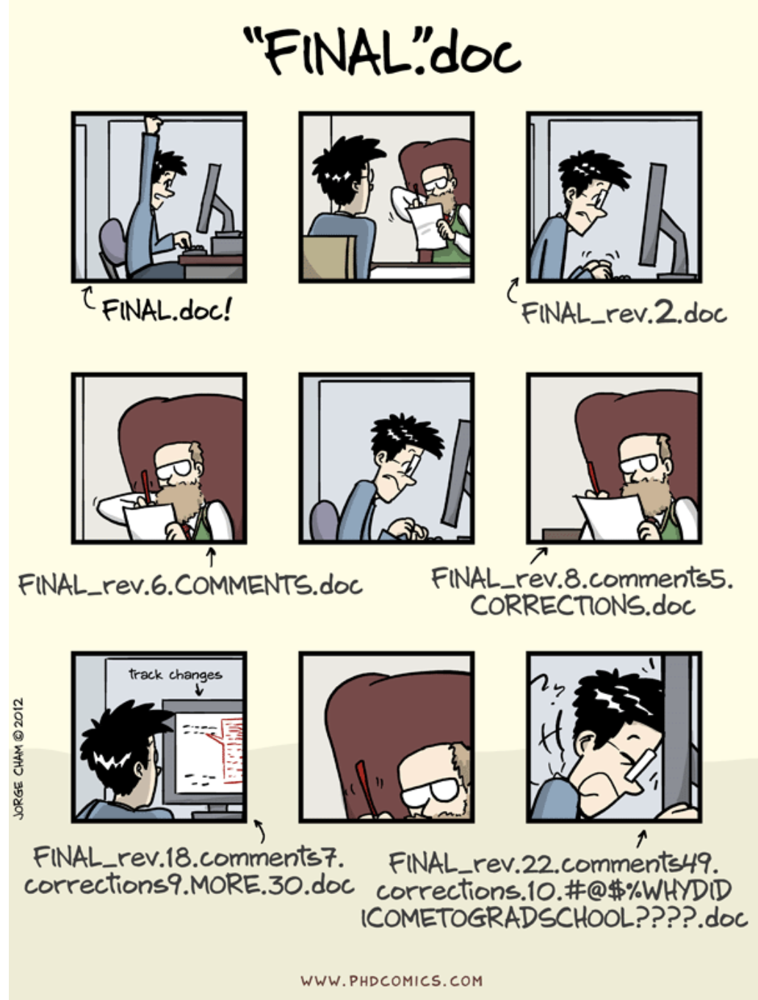

# Syllabus

## Course info
__Instructor__:  
Daniel McDonald  
Office: Harper Center 359
Website: http://mypage.iu.edu/~dajmcdon  
Email: daniel.mcdonald@chicagobooth.edu

__Office hours__:  
Me: TBA

__Course webpage__:    
WWW: https://booth41911.github.io/  
Github: https://github.com/booth41911  
Piazza: https://piazza.com/chicagobooth/fall2018/bus41911/home
Piazza sign-up: https://piazza.com/chicagobooth/fall2018/bus41911

__Lectures__:  
Tuesday 2-5pm, Harper Center Seminar Room 3SW

__Textbook__:  
Required: ESL = [_Elements of Statistical Learning_](https://web.stanford.edu/~hastie/ElemStatLearn/)  

__Prerequisite__:  
Ph.D.-level course(s) in mathematical statistics and econometrics at the level of Business 41901, 41902, 41903 or Economics 31000-31200.

## Course objectives

Topics: 
1. Data analysis workflow; 
2. Supervised learning; 
3. Model selection; 
4. Dimension reduction;
5. Graphical Models/Time series/Causal inference if time allows.  

Applications from finanace/macro/marketing as best I can.

Emphasis on developing a workflow to avoid mistakes.

## Lectures

Class time will consist of a
combination of lecture, discussion, questions and answers, and problem
solving, with a focus on problem solving. You are strongly encouraged
to bring a laptop to class.

## Textbook

The required textbook for this class is the standard for ML at this level. 
It is excellent and free electronically. 

There are some extra suggested materials (especially for this week). They are linked on the website.

If you find additional resources, let me know! I'll link them.

## Course communication

We'll use Piazza. (Seems common to Booth?)

Try to constrain communication to Piazza.


## Grading

* First class pre-test, 5% (completion)
* Participation on in-class exercises and Piazza, 15%
* Group/individual homework (3-4 exercises), 20%
* Take-home midterm exam, 25%
* Course project, 10% (PC1), 25% (PC2)


## In-class exercises

We will regularly have short programming or theoretical exercises during class time. 


## Homeworks

* All assignments will be submitted on Github. 
* Homework grades
will be awarded based on complete and accurate analyses according to the rubric provided with each assignment.
* Note that the submission repo is __public__ (to the class)

## Project

* You will be required to complete a project (1-3 people). 
* You may choose this group. 
* The goal is to analyze a dataset in depth using anything that you have learned. 
* See the [project](https://booth41911.github.io/project.html) page for detailed requirements.
* This is a PhD course.

The entire class will give brief presentations during the last week of classes. 


## Exams

* One take-home exam to be completed entirely individually. 
* The midterm will be made available by __Thursday, October 25__ 
* Submission by __Thursday, November 1__ at 11:59pm.

> If either of these dates pose some type of problem, you must notify me no later than Friday, September 28. After this date, no alternatives will be considered without medical documentation.


## Solutions

* Some of the problems that are assigned are similar or identical to those assigned in previous years
by me or other instructors for this or other courses. 
* Using proofs or
code from anywhere other than the textbooks (with attribution), this
year's course notes (with attribution), or the course website is not
only considered cheating 
(as described above), it is easily detectable cheating. 


## Cheating

(Things I hope I don't have to say.)

* In previous years, I have caught students cheating on exams. 
* Cheating, in my experience, occurs because students don't understand the material, so the result is usually a failing grade even before I impose any penalty and report the incident to the Dean's office. 
* I carefully structure exams to make it so that I can catch these issues. 
* I ~~will~~ catch you, and it does not help. 
* If you are struggling, I want to help.

> If I suspect cheating, your case will be forwarded to the Dean's office. No questions asked.

# Github

## Acknowledgements

* Much of this lecture is borrowed/stolen from Colin Rundel and Karl Broman


## Why version control?

<p align=center>

</p>

## Why version control?

* Simple formal system for tracking all changes to a project
* Time machine for your projects
    + Track blame and/or praise
    + Remove the fear of breaking things
* Learning curve is steep, but when you need it you REALLY need it

> Your closest collaborator is you six months ago, but you don’t reply to emails.
> -- _Paul Wilson_

## Why Git

* You could use something like Box or Dropbox
* These are poor-man's version control
* Git is much more appropriate
* It works with large groups
* It's very fast
* It's much better at fixing mistakes
* Tech companies use it (so it's in your interest to have some experience)

> This will hurt, but what doesn't kill you, makes you stronger.

## Why part 2

* As a student, I didn't know anything about git/github.
* No one taught me how to use it.
* As a Professor who collaborates a lot, I find it indispensible.
* I had to learn it on my own, and I still have trouble.
* If I make you do it, you'll be better off than I was.

__JMLR vs. dajmcdon/dpf__

## Set up

* Open Rstudio
* Go to the "Tools" menu and select "Shell"
* Type 

```
git --version
```

* If it's there, you're done.
* For detailed install instructions, or to be more choosy in the version you get, see [Happy git with R](http://happygitwithr.com/install-git.html)

## (Hard way, Windows)

* Install [Git for Windows](https://git-for-windows.github.io/), also known as `msysgit` or "Git Bash", 
*  **NOTE:** Select "Use Git from the Windows Command Prompt" during installation. Otherwise, we believe it's OK to accept the defaults.
* Note that RStudio for Windows prefers for Git to be installed below `C:/Program Files`, often at `C:/Program Files/Git/bin/git.exe`. 


## (Hard way, Mac)

Install the Xcode command line tools (**not all of Xcode**), which includes Git. If your OS is older than 10.11 El Capitan, it is possible that you **must** install the Xcode command line tools in order for RStudio to find and use Git.

Go to the shell and enter one of these commands to elicit an offer to install developer command line tools:

``` bash
git --version
git config
```

Accept the offer! Click on "Install".

## (Hard way, Linux)

Install Git via your distro's package manager.

Ubuntu or Debian Linux:

```sh
sudo apt-get install git
```

Fedora or RedHat Linux:

```sh
sudo yum install git
```

# Pause for actions

## Initial configuration

* Now tell it who your are:

```
$ git config --global user.name "Daniel McDonald"
$ git config --global user.email "dajmcdon@gmail.com"
$ git config --global core.editor nano
```

* `nano` is a light-weight text editor. You probably won't ever use it, but it's good to tell
git to use nano. If for some reason git asks you questions about doing things, just remember

> Ctrl + X is quit

(it says this at the bottom of the window)

* This is all that we will do with git in the terminal
* Rstudio has git built in, and so we'll use it through there mostly
* Using the terminal gives access to more complicated issues, which hopefully we won't have to deal with.

## Github

* This is a commercial site that interacts with Git (GitLab and Bitbucket do as well)
* You need a free account http://www.github.com/ (get the Education one)
* Git tracks changes to your files in both places
* Your files live in __repositories__ (repos in the lingo)
* You and others share access to repos

## When you want to work on a file

* You __pull__ the repo onto your local machine
* Make all your changes, saveing as many times as you like.
* You __commit__ your changes with a message, e.g.: "I fixed the horrible bug"
* You __push__ your changes back to the repo

## Syncing up with Rstudio

Demonstration:

1. Preferences > Git/svn 
2. If there is a key there, and you know when you made it/how to use it, skip to 4.
3. If empty, "Create"
4. "View public key", copy.
5. Github.com > Profile photo > Settings > SSH and GPG key > New SSH
6. Paste

Now you don't need your passphrase (from this computer)

## In class practice

* Go to https://github.com/booth41911/class-roster/
* Clone or download.
* Rstudio > New Project > Version Control > Git 
* Add your information to the table. 
* Save.
* Stage (click the box). Commit (add message).
* __Pull__
* Fix issues.
* Push