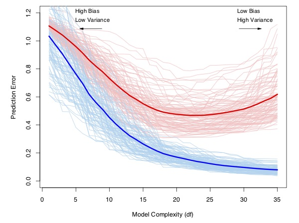
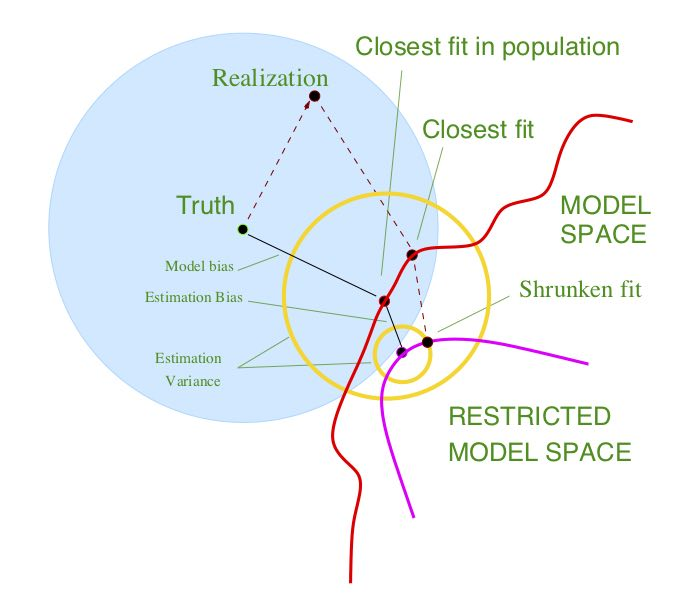
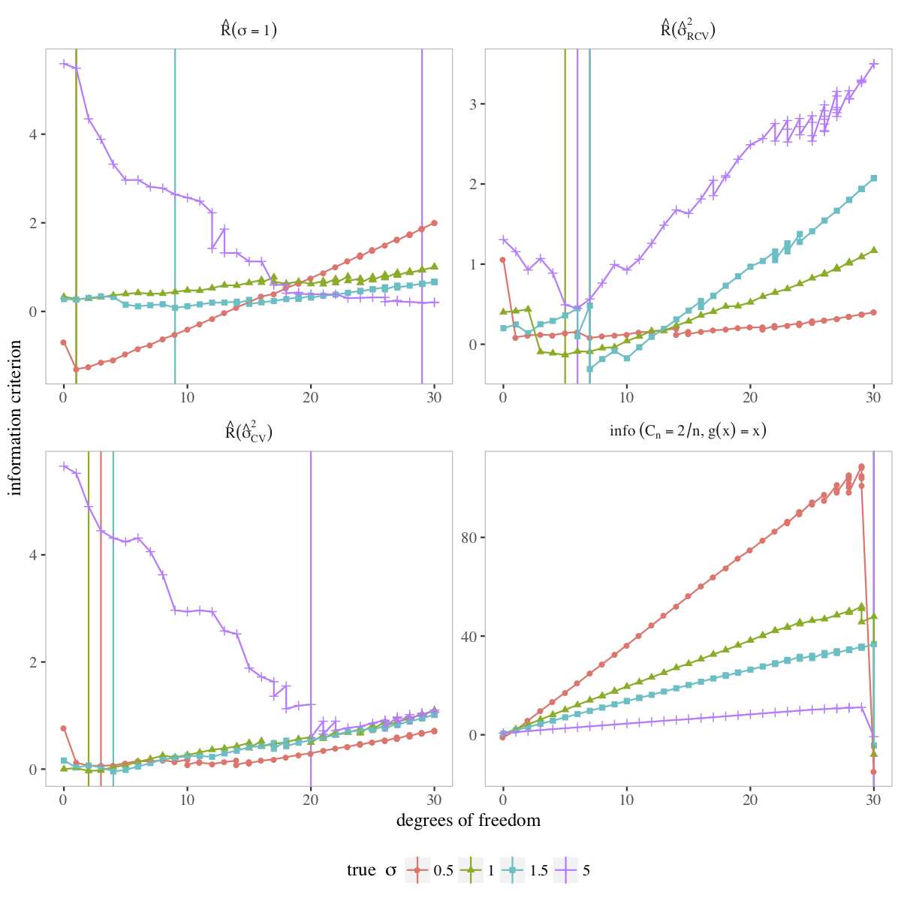

\newcommand{\E}{\mathbb{E}}
\newcommand{\Expect}[1]{\mathbb{E}\left[ #1 \right]}
\newcommand{\Var}[1]{\mathbb{V}\left[ #1 \right]}
\newcommand{\Cov}[2]{\mathrm{Cov}\left[#1,\ #2\right]}
\newcommand{\given}{\ \vert\ }
\renewcommand{\P}{\mathbb{P}}
\newcommand{\R}{\mathbb{R}}
\newcommand{\argmin}{\arg\min}
\newcommand{\argmax}{\arg\max}
\newcommand{\F}{\mathcal{F}}
\newcommand{\norm}[1]{\left\lVert #1 \right\rVert}
\newcommand{\indicator}{\mathbf{1}}
\renewcommand{\bar}{\overline}
\renewcommand{\hat}{\widehat}
\newcommand{\tr}[1]{\mbox{tr}(#1)}


```{r setup, include=FALSE}
knitr::opts_chunk$set(message=FALSE, warning=FALSE,
               fig.align='center',fig.width=10,
               fig.height=6, cache=TRUE, autodep = TRUE)
library(tidyverse)
theme_set(theme_minimal(base_family="Times"))
green = '#00AF64'
blue = '#0B61A4'
red = '#FF4900'
orange = '#FF9200'
colvec = c(green,blue,red,orange)
```


## Model selection and tuning parameters

* Often "model selection" means "choosing a set of predictors"
    - E.g. Lasso performs model selection by setting many $\hat\beta=0$
* I define "model selection" more broadly
* I mean "making any necessary decisions to arrive at a final model"
* Sometimes this means "choosing predictors""
* It could also mean "selecting a tuning parameter"
* Or "deciding whether to use LASSO or Ridge" (and picking tuning parameters)
* Recall Lecture 2: "A statistical model $\mathcal{P}$ is a collection of 
probability
* Model selection means "choose $\mathcal{P}$"
distributions or densities." 

## My pet peeve

* Often people talk about "using LASSO" or "using an SVM"
* This isn't quite right.
* LASSO is a regularized procedure that depends on $\lambda$
* To "use LASSO", you must pick a particular $\lambda$
* Different ways to pick $\lambda$ (today's topic) produce different final 
estimators
* Thus we should say "I used LASSO+CV" or "I used Ridge+GCV"
* Probably also indicate "how" (I used the CV minimum.)

## Bias and variance

Recall that $\mathcal{D}$ is the training data.

\[
R_n(f) := \Expect{L(Y,f(X))} = \Expect{\Expect{L(Y,f(X)) \given \mathcal{D}}}
\]

* The book calls $R_n(f) = \textrm{Err}$ and $\Expect{L(Y,f(X)) \given \mathcal{D}} = \textrm{Err}_\mathcal{D}$
* If you use $\mathcal{D}$ to choose $f$, then these are different.
* If you use $\mathcal{D}$ to choose $f$, then both depend on how much data you have seen.


## Risk estimates



* We can use risk estimates for 2 different goals

1. Choosing between different potential models.
2. Characterizing the out-of-sample performance of the chosen model.

* I am not generally aware of other methods of accomplishing (1).
* You could avoid making a choice (Chapter 8), or you could use a procedure that makes the choice "automatically"
* The method you choose to estimate risk will have large implications for both 1 and 2.

## A model selection picture



## Why?

We want to do model selection for at least three reasons:

-   __Prediction accuracy:__ Can
    essentially *always* be improved by introducing some bias

-   __Interpretation:__ A large
    number of features can sometimes be distilled into a smaller number
    that comprise the "big (little?) picture"

-   __Computation:__ A large $p$
    can create a huge computational bottleneck.

## Things you shouldn't do

* Estimate $R_n$ with $\hat{R}_n(f) = \sum_{i=1}^n L(Y_i,\hat{f}(X_i))$.
* Throw away variables with small $p$-values.
* Use $F$-tests
* Compare the log-likelihood between different models

(These last two can occasionally be ok, but aren't in general. You should investigate the assumptions that are implicit in them.)

# Risk estimators

## Unbiased risk estimation

* It is very hard (impossible?) to estimate $R_n$.
* Instead we focus on 
\[
\overline{R}_n(f) = \E_{Y_1,\ldots,Y_n}\left[\E_{Y^0}\left[\frac{1}{n}\sum_{i=1}^n L(Y^0_i,\hat{f}(x_i))\given \mathcal{D}\right]\right].
\]
* The difference is that $\overline{R}_n(f)$ averages over the observed $x_i$ rather than taking the expected value over the distribution of $X$.
* In the "fixed design" setting, these are equal.

For many $L$ and some predictor $\hat{f}$, one can show
\[
\overline{R}_n(\hat{f}) = \Expect{\hat{R}_n(\hat{f})} + \frac{2}{n} \sum_{i=1}^n \Cov{Y_i}{\hat{f}(x_i)}.
\]

This suggests estimating $\overline{R}_n(\hat{f})$ with
\[
\hat{R}_{gic} := \hat{R}_n(\hat{f}) + \textrm{pen}.
\]

If $\Expect{\textrm{pen}} = \frac{2}{n}\sum_{i=1}^n \Cov{Y_i}{\hat{f}(x_i)}$, we have an unbiased estimator of $\overline{R}_n(\hat{f})$.

# Example: Normal means

## Normal means model


Suppose we observe the following data:
\[
Y_i = \beta_i + \epsilon_i, \quad\quad i=1,\ldots,n
\]
where $\epsilon_i\overset{iid}{\sim} \mbox{N}(0,1)$.
  
  
We want to estimate \[\boldsymbol{\beta} = (\beta_1,\ldots,\beta_n).\] 


The usual estimator (MLE) is \[\widehat{\boldsymbol{\beta}}^{MLE} = (Y_1,\ldots,Y_n).\]


This estimator has lots of nice properties: __consistent, unbiased, UMVUE, (asymptotic) normality...__

## MLEs are bad

  
But, the standard estimator __STINKS!__ It's a bad estimator. 
  
It has no bias, but big variance.

\[
R_n(\widehat{\boldsymbol{\beta}}^{MLE}) = \mbox{bias}^2 + \mbox{var} = 0
+ n\cdot 1= n
\]

What if we use a biased estimator?

Consider the following estimator instead:
\[
\widehat{\beta}_i^S = \begin{cases} Y_i & i \in S\\ 0 & \mbox{else}. \end{cases}
\]
  
Here $S \subseteq \{1,\ldots,n\}$. 


## Biased normal means


What is the risk of this estimator?

\[
R_n(\widehat{\boldsymbol{\beta}}^S) = \sum_{i\not\in S} \beta_i^2 + |S|.
\]

In other words, if some $|\beta_i| < 1$, then don't bother estimating them!

In general, introduced parameters like $S$ will be called __tuning parameters__.

Of course we don't know which $|\beta_i| < 1$.

But we could try to estimate $R_n(\widehat{\boldsymbol{\beta}}^S)$, and choose $S$ to minimize our estimate.


## Estimating the risk


By definition, for any estimator $\widehat{\boldsymbol{\beta}}$, 
  
\[
R_n(\widehat{\boldsymbol{\beta}}) = 
\E\left[ \sum_{i=1}^n
    (\widehat{\beta_i}-\beta_i)^2\right]
\]

An intuitive estimator of $R_n$ is

\[
  \widehat{R}_n(\widehat{\boldsymbol{\beta}}) = \sum_{i=1}^n (\widehat{\beta_i}- Y_i)^2.
\]

This is known as the  __training error__ and it can be shown that 
\[
  \widehat{R}_n(\widehat{\boldsymbol{\beta}})  \approx R_n(\widehat{\boldsymbol{\beta}}).
\]

Also,
\[
\widehat{\boldsymbol{\beta}}^{MLE} = \arg\min_{\beta}  \widehat{R}_n(\widehat{\boldsymbol{\beta}}^{MLE}).
\]
  
What could possibly go wrong?


## Dangers of using the training error


Although
\[
  \widehat{R}_n(\widehat{\boldsymbol{\beta}})  \approx R_n(\widehat{\boldsymbol{\beta}}),
\]
this approximation can be very bad.  In fact:


__Training Error:__  $\widehat{R}_n(\widehat{\boldsymbol{\beta}}^{MLE}) = 0$

__Risk:__ $R_n(\widehat{\boldsymbol{\beta}}^{MLE}) = n$

In this case, the  __optimism__ of the training error is $n$. 


## Normal means

What about $\widehat{\boldsymbol{\beta}}^S$?

\[
  \widehat{R}_n(\widehat{\boldsymbol{\beta}}^S) = \sum_{i=1}^n (\widehat{\beta_i}-
  Y_i)^2 = \sum_{i \notin S} Y_i^2 %+ |S|\sigma^2
\]

Well
\[
  \E\left[\widehat{R}_n(\widehat{\boldsymbol{\beta}}^S)\right] =
  R_n(\widehat{\boldsymbol{\beta}}^S) - 2|S| +n.
\]

So I can choose $S$ by minimizing $\widehat{R}_n(\widehat{\boldsymbol{\beta}}^S) + 2|S|$. 
  
\[
\mbox{Estimate of Risk} = \mbox{training error} + \mbox{penalty}.
\]
  
The penalty term corrects for the optimism.


## pen in the nice cases

__Result:__  
Suppose $\hat{f}(x_i) = HY$ for some matrix $H$, and $Y_i$'s are IID. Then 
\[
\frac{2}{n} \sum_{i=1}^n \Cov{Y_i}{\hat{f}(x_i)} = \frac{2}{n} \sum_{i=1}^n H_{ii} \Cov{Y_i}{Y_i} = \frac{2\Var{Y}}{n} \tr{H}.
\]

* Such estimators are called "linear smoothers".
* Obvious extension to the heteroskedastic case.
* We call $\frac{1}{\Var{Y}}\sum_{i=1}^n \Cov{Y_i}{\hat{f}(x_i)}$ the __degrees of freedom__ of $\hat{f}$.
* Linear smoothers are ubiquitous
* Examples: OLS, ridge regression, KNN, dictionary regression, smoothing splines, kernel regression, etc.


## Examples of DF

* OLS
\[
H = X^\top (X^\top X)^{-1} X^\top \Rightarrow \tr{H} = \textrm{rank}(X) = p
\]

* Ridge (decompose $X=UDV^\top$)
\[
H = X^\top (X^\top X + \lambda I_p)^{-1} X^\top \Rightarrow \tr{H} = \sum_{i=1}^p \frac{d_i^2}{d_i^2 + \lambda} < \min\{p,n\}
\]

* KNN $\textrm{df} = n/K$ (each point is it's own nearest neighbor, it gets weight $1/K$)


## Finding risk estimators

This isn't the way everyone introduces/conceptualizes prediction risk.

For me, thinking of $\hat{R}_n$ as
overly optimistic and correcting for that
optimism is conceptually appealing

We need to also discuss __information criteria__.

In this case one forms a (pseudo)-metric on probability measures.


# Comparing probability measures

## Kullback-Leibler

Suppose we have data $Y$ that comes from the probability density
function $f$.


What happens if we use the probability density function $g$ instead?


__Example:__   
Suppose
$Y \sim N(\mu,\sigma^2) =: f$. We want to predict a new $Y_*$, but we
model it as $Y_* \sim N(\mu_*,\sigma^2) =: g$

How _far_ away are we? We can either compare
$\mu$ to $\mu_*$ or $Y$ to $Y^*$.

Or, we can compute how _far_ $f$ is from $g$.

We need a notion of distance.

## Kullback-Leibler

One central idea is __Kullback-Leibler__
divergence (or discrepancy)

$$\begin{aligned}
KL(f,g) & = \int \log\left( \frac{f(y)}{g(y)} \right)f(y) dy \\
& \propto
-\int \log (g(y)) f(y) dy \qquad \textrm{(ignore term without $g$)}\\
& = 
-\mathbb{E}_f [\log (g(Y))] \end{aligned}$$

This gives us a sense of the __loss__ incurred
by using $g$ instead of $f$.

* KL is not symmetric: $KL(f,g) \neq KL(g,f)$, so it's not a distance, but it is non-negative and satisfies the triangle inequality.

Usually, $g$ will depend on some parameters, call them $\theta$


## KL example


* In regression, we can specify $f = N(X^{\top} \beta_*, \sigma^2)$ 
* for a fixed (true) $\beta_*$, 
* let $g_\theta = N(X^{\top}\beta,\sigma^2)$ over all $\theta = (\beta,\sigma^2) \in \mathbb{R}^p\times\mathbb{R}^+$
* $KL(f,g_\theta) = -\mathbb{E}_f [\log (g_\theta(Y))]$, we want to minimize
this over $\theta$.
* But $f$ is unknown, so we minimize $-\log (g_\theta(Y))$
instead. 
* This is the maximum likelihood value
$$\hat{\theta}_{ML} = \argmax_\theta g_\theta(Y)$$
* We don't actually need to assume things about a true model nor have it be nested in
the alternative models to make this work.

## Operationalizing

* Now, to get an operational characterization of the KL divergence at the
ML solution $$-\mathbb{E}_f [\log (g_{\hat\theta_{ML}}(Y))]$$ we need an
approximation (don't know $f$, still).


__Result__:  
If you maximize the likelihood for a finite dimensional parameter vector $\theta$ of length $p$, then as $n\rightarrow \infty$,
\[-\mathbb{E}_f [\log (g_\theta(Y))] = -\log (g_\theta(Y)) + p.\]

* This is AIC (originally "an information criterion", now "Akaike's information criterion").
* Choose the model with smallest AIC
* Often multiplied by 2 "for historical reasons". Ocassionally, given as the negative of this "to be extra annoying".
* Your estimator for $\theta$ needs to be the MLE. $p$ includes all estimated parameters.

## Back to the OLS example

* Suppose $Y$ comes from the standard normal linear regression model with known variance $\sigma^2$. 

\[
\begin{aligned}
-\log(g_{\hat{\theta}}) &\propto \log(\sigma^2) + \frac{1}{2\sigma^2}\sum_{i=1}^n (y_i - x_i^\top \hat{\beta}_{MLE})^2\\ \Rightarrow AIC &= 2\frac{n}{2\sigma^2}\hat{R}_n + 2p = \hat{R}_n + \frac{2\sigma^2}{n} p.
\end{aligned}
\]

* Suppose $Y$ comes from the standard normal linear regression model with _unknown_ variance $\sigma^2$. Note that $\hat{\sigma}_{MLE}^2 = \frac{1}{n} \sum_{i=1}^n (y_i-x_i^\top\hat{\beta}_{MLE})^2$. 

\[
\begin{aligned}
-\log(g_{\hat{\theta}}) &\propto \frac{n}{2}\log(\hat{\sigma}^2) + \frac{1}{2\hat{\sigma^2}}\sum_{i=1}^n (y_i - x_i^\top \hat{\beta}_{MLE})^2\\ \Rightarrow AIC &\propto 2 n\log(\hat{\sigma}^2)/2 + 2(p+1) \propto \log(\hat{R}_n) + \frac{2(p+1)}{n}.
\end{aligned}
\]


# Related quantities

## Mallow's Cp

* Defined for linear regression.
* No likelihood assumptions.
* Variance is known
\[
C_p = \hat{R}_n + 2\sigma^2 \frac{\textrm{df}}{n} = AIC
\]

## Bayes factor

For Bayesian Analysis, we want the posterior. Suppose we have two models A and B.

\[
\begin{aligned}
P(B\given \mathcal{D}) &= \frac{P(\mathcal{D}\given B)P(B)}{P(\mathcal{D})} 
\propto P(\mathcal{D}\given B)P(B)\\
P(A\given \mathcal{D}) &= \frac{P(\mathcal{D}\given A)P(A)}{P(\mathcal{D})} 
\propto P(\mathcal{D}\given A)P(A)
\end{aligned}
\]
We assume that $P(A) = P(B)$. Then to compare, 
\[
\frac{P(B\given \mathcal{D})}{P(A\given \mathcal{D})} = \frac{P(\mathcal{D}\given B)}  {P(\mathcal{D}\given A)}.
\]

* Called the __Bayes Factor__.
* This is the ratio of marginal likelihoods under the different models. 
* Not easy to calculate generally.
* Use the Laplace approximation, some simplifications, assumptions:
\[
\log P(\mathcal{D}\given B) = \log P(\mathcal{D} \given \hat{\theta},\ B) -\frac{p\log(n)}{2} + O(1)
\]
* Multiply through by $-2$:
\[
BIC = -\log (g_\theta(Y)) + p\log(n) = \log(\hat{R}_n) + \frac{p\log(n)}{n}
\]
* Also called Schwarz IC. Compare to AIC (variance unknown case)

## SURE

\[
\hat{R}_{gic} := \hat{R}_n(\hat{f}) + \textrm{pen}.
\]
If $\Expect{\textrm{pen}} = \frac{2}{n}\sum_{i=1}^n \Cov{Y_i}{\hat{f}(x_i)}$, we have an unbiased estimator of $\overline{R}_n(\hat{f})$.

__Result: (Stein's Lemma)__  
Suppose $Y_i\sim N(\mu_i,\sigma^2)$ and suppose $f$ is weakly differentiable. Then
\[
\frac{1}{\sigma^2} \sum_{i=1}^n\Cov{Y_i}{\hat{f}_i(Y)} = \Expect{\sum_{i=1}^n \frac{\partial f_i}{\partial y_i} \hat{f}(Y)}.
\]

* Note: Here I'm writing $\hat{f}$ as a function of $Y$ rather than $x$. 
* This gives "Stein's Unbiased Risk Estimator"
\[
SURE = \hat{R}_n(\hat{f}) + 2\sigma^2 \sum_{i=1}^n \frac{\partial f_i}{\partial y_i} \hat{f}(Y) - n\sigma^2.
\]

* If $f(Y) = HY$ is linear, we're back to AIC (variance known case)
* If $\sigma^2$ is unknown, may not be unbiased anymore. May not care.

# CV

## What is Cross Validation

- Cross validation
- This is another way or estimating the prediction risk.
- Why?

To recap:
  
   \[
  R_n(\widehat{f}) = \E[\ell(Y,\widehat{f}(X))]
  \]
  where the expectation is taken over the new data point $(Y,X)$
  and $\mathcal{D}_n$ (everything that is random).
  
We saw one estimator of $R_n$: 
\[
\widehat{R}_n(\widehat{f}) = \sum_{i=1}^n \ell(Y_i,\widehat{f}(X_i)).
\]

This is the training error. It is a __BAD__ estimator because it is often optimistic.

## Intuition for CV


* One reason that $\widehat{R}_n(\widehat{f})$ is bad is that we are using the same data to pick $\widehat{f}$ __AND__ to estimate $R_n$.

* Notice that $R_n$ is an expected value over a __NEW__ observation $(Y,X)$.

* We don't have new data.

## Wait a minute...

...or do we?

* What if we set aside one observation, say the first one $(Y_1, X_1)$.

* We estimate $\widehat{f}^{(1)}$ without using the first observation.

* Then we test our prediction:

\[
  \widetilde{R}_1(\widehat{f}^{(1)}) = \ell(Y_1, \widehat{f}^{(1)}(X_1)).
\]

* But that was only one data point $(Y_1, X_1)$. Why stop there?

* Do the same with $(Y_2, X_2)$! Get an estimate $\widehat{f}^{(2)}$ 
without using it, then

\[
  \widetilde{R}_2(\widehat{f}^{(2)}) = \ell(Y_2, \widehat{f}^{(2)}(X_2)).
\]

## Keep going

* We can keep doing this until we try it for every data point.
* And then average them! (Averages are good)
* In the end we get
\[
\mbox{LOO-CV} = \sum_{i=1}^n \widetilde{R}_i(\widehat{f}^{(i)}) = \sum_{i=1}^n 
\ell(Y_i - \widehat{f}^{(i)}(X_i))
\]
* This is leave-one-out cross validation

## Problems with LOO-CV

1. Each held out set is small $(n=1)$. Therefore, the variance of my predictions is high.
2. Since each held out set is small, the training sets overlap. This is bad. 
    * Usually, averaging reduces variance:
    \[
    \Var{\overline{X}} = \frac{1}{n^2}\sum_{i=1}^n \Var{X_i} = \frac{1}{n}\Var{X_1}.
    \]
    * But only if the variables are independent. If not, then
    \[
    \begin{aligned}
    \Var{\overline{X}} &= \frac{1}{n^2}\Var{ \sum_{i=1}^n X_i}\\ 
      & = \frac{1}{n}\Var{X_1} + \frac{1}{n^2}\sum_{i\neq j} \Cov{X_i}{X_j}.
    \end{aligned}
    \]
    * Since the training sets overlap a lot, that covariance can be pretty big.
3. We have to estimate this model $n$ times.
    * There is an exception to this one. More on that in a minute.
    
## Generic Cross Validation

Let $\mathcal{N} = \{1,\ldots,n\}$ be the index set for $\mathcal{D}$

Define a distribution $\mathcal{V}$ over $\mathcal{N}$ ($v\sim\mathcal{V} \subseteq \mathcal{N}$)

Then, we can form a general _cross-validation_
estimator as
\[
\textrm{CV}_{\mathcal{V}}(\hat f) =  \Expect{\frac{1}{|v|} \sum_{i \in v} L\left(Y_i, \hat{f}^{(v)}(X_i)\right) \given \mathcal{V}}
\]

## More general cross-validation schemes: Examples

\[
\textrm{CV}_{\mathcal{V}}(\hat f) =  \Expect{\frac{1}{|v|} \sum_{i \in v} L\left(Y_i, \hat{f}^{(v)}(X_i)\right) \given \mathcal{V}}
\]

-   __K-fold:__  
    Fix
    $V = \{ v_1,\ldots,v_K\}$ such that $v_j \cap v_k = \emptyset$ and
    $\bigcup_j v_j = \mathcal{N}$
    $$\textrm{CV}_{K}(\hat f) = \frac{1}{K} \sum_{v \in V} \frac{1}{|v|} \sum_{i \in v}     (Y_i - \hat{f}^{(v)}(X_i))^2$$

-   __Bootstrap:__  
    Let
    $\mathcal{V}$ be given by the bootstrap distribution over
    $\mathcal{N}$ (that is, sampling $B$ indices randomly with replacement many times)

-   __Factorial:__  
    Let
    $\mathcal{V}$ be given by all subsets (or a subset of all subsets)
    of $\mathcal{N}$ (that is, putting mass $1/(2^n-2)$ on each subset)


## More general cross-validation schemes: A comparison

-   $\textrm{CV}_{K}$ gets more computationally demanding as
    $K \rightarrow n$

-   The bias of $\textrm{CV}_{K}$ goes down, but the variance increases
    as $K \rightarrow n$

-   The factorial version isn't commonly used except when doing a 'real'
    data example for a methods paper

-   There are many other flavors of CV. One of them, called "consistent
    cross validation"
    is a recent
    addition that is designed to work with
    sparsifying algorithms
    
- $K$-fold is most common (like $K=10$ or $K=5$)

  
## K-fold CV


  1. Divide the data into $K$ groups. 
  2. Leave a group out and estimate with the rest.
  3. Test on the held-out group. Calculate an average risk over these $\sim n/K$ data.
  4. Repeat for all $K$ groups.
  5. Average the average risks.
  

## Why K-fold better?
  1. Less overlap, smaller covariance.
  2. Larger hold-out sets, smaller variance.
  3. Less computations (only need to estimate $K$ times)

## Why might it be worse?

  1. LOO-CV is (nearly) unbiased. 
  2. The risk depends on how much data you use to estimate the model. 
  3. LOO-CV uses almost the same amount of data.
  
  
## A picture

```{r, fig.align='center',echo=FALSE}
par(mar=c(0,0,0,0))
plot(NA, NA, ylim=c(0,5), xlim=c(0,10), bty='n', yaxt='n', xaxt='n')
rect(0,.1+c(0,2,3,4),10,.9+c(0,2,3,4))
rect(c(0,1,2,9),rev(.1+c(0,2,3,4)),c(1,2,3,10),rev(.9+c(0,2,3,4)),col=red)
points(c(5,5,5),1+1:3/4,pch=19)
text(8,4.5,'Training data',cex=3)
text(2,1.5,'Testing data',cex=3,col=2)
```

## Comparison

* LOO-CV and AIC are asymptotically equivalent ($n\rightarrow \infty$, $p<n$), [@Stone1977]
* Properties of AIC/BIC in high dimensions are not well understood.
* In low dimensions, AIC is minimax optimal for the prediction risk [@YangBarron1998]
* CV is consistent for the prediction risk [@Dudoit2005]
* Both tend to over-select predictors (unproven, except empirically)
* BIC asymptotically selects the correct linear model in low dimensions [@shao1997asymptotic] and in high dimensions [@wang2009shrinkage]
* In linear regression, it is impossible for a model selection criterion to be minimax optimal and select the correct model asymptotically [@yang2005can]
* In high dimensions, if the variance is unknown, the "known" variance form of AIC/BIC is disastrous.
* __Conclusion:__ your choice of risk estimator impacts results. Thus, 
    1. If you want to select models, you might pick BIC
    2. If you want good predictions, you might use CV
    3. It's possible LASSO+CV(1se) picks models better than LASSO+CV(min)

## AIC/BIC disaster

```{r,eval=FALSE}
n = 30; p = 150
sigma = c(.5, 1, 1.5, 5)
beta = c(1, 0, ..., 0)
Y = X %*% beta + sigma * rnorm(n)
```




# (Brief) foray into model averaging

## What if we don't want to choose?

1. Choose a risk estimator $\hat{R}$
2. Calculate weights $p_i = \exp{-\hat{R}(\textrm{Model}_i)}$
3. Create final estimator $\hat{f} = \sum_{\textrm{models}} \frac{p_i}{\sum p_i} \hat{f}_i$.

* If $\hat{R}$ is BIC, this is (poor-man's) Bayesian Model Averaging.
* Real BMA integrates over the models: $$P(f \given \mathcal{D}) = \int P(f \given M_i, \mathcal{D}) P(M_i \given \mathcal{D}) dM$$
* Averaging + Sparsity is pretty hard.
* Interesting open problem: how can we combine LASSO models over the path?
* Issue with MA: $e^{-BIC}$ can be tiny for all but a few models. You're not averaging anymore.


## Selected references