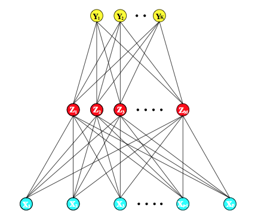
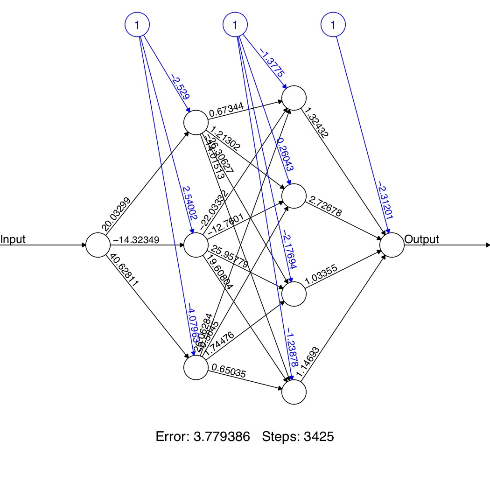
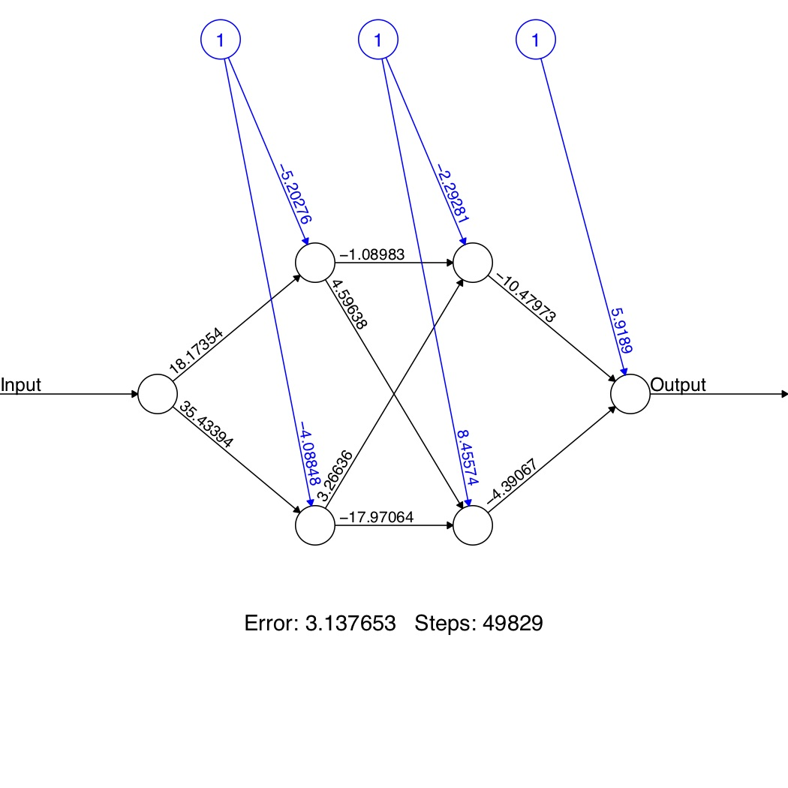
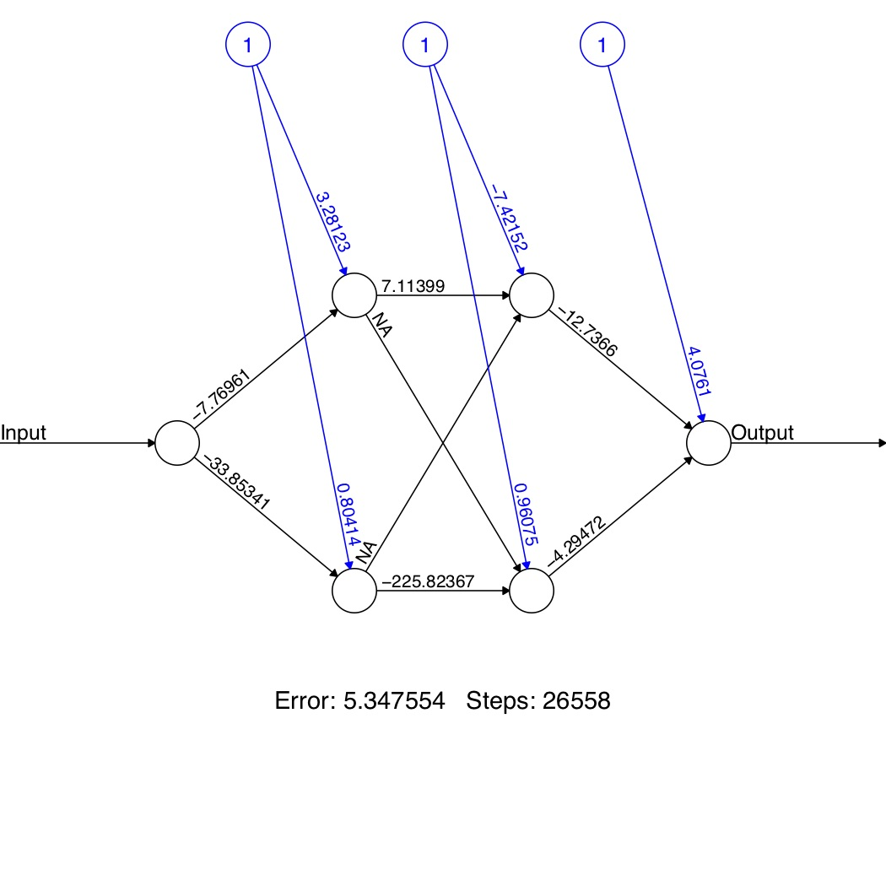
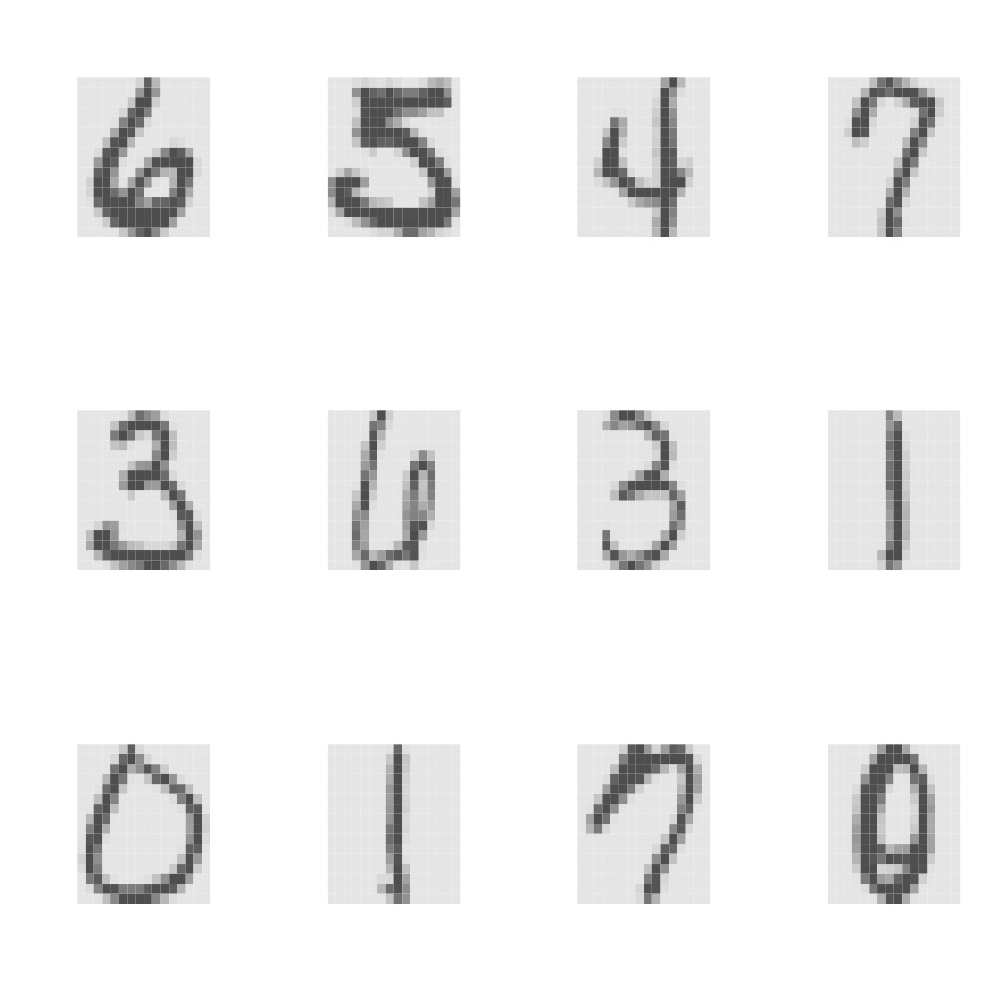

\newcommand{\E}{\mathbb{E}}
\newcommand{\Expect}[1]{\mathbb{E}\left[ #1 \right]}
\newcommand{\Var}[1]{\mathbb{V}\left[ #1 \right]}
\newcommand{\Cov}[2]{\mathrm{Cov}\left[#1,\ #2\right]}
\newcommand{\given}{\ \vert\ }
\renewcommand{\P}{\mathbb{P}}
\newcommand{\R}{\mathbb{R}}
\newcommand{\argmin}{\arg\min}
\newcommand{\argmax}{\arg\max}
\newcommand{\F}{\mathcal{F}}
\newcommand{\norm}[1]{\left\lVert #1 \right\rVert}
\newcommand{\indicator}{\mathbf{1}}
\renewcommand{\bar}{\overline}
\renewcommand{\hat}{\widehat}
\newcommand{\tr}[1]{\mbox{tr}(#1)}


```{r setup, include=FALSE}
library(knitr)
opts_chunk$set(message=FALSE, warning=FALSE,
               fig.align='center',fig.width=10,
               fig.height=6, cache=TRUE, autodep = TRUE)
library(MASS)
library(tidyverse)
library(splines)
library(neuralnet)
theme_set(theme_minimal(base_family="Times"))
green = '#00AF64'
blue = '#0B61A4'
red = '#FF4900'
orange = '#FF9200'
colvec = c(green,blue,red,orange)
```

## Overview

Neural networks are models for supervised
learning

 
Linear combinations of features  are passed
through a non-linear transformation in successive layers

 
At the top layer, the resulting latent
factors are fed into an algorithm for
predictions

(Most commonly via least squares or logistic regression)

 
Chapter 11 in ESL is a good introductory reference for neural networks


## Background

Neural networks have come about in 3 "waves" of research

The first was an attempt in the 1950s to model the mechanics of the human brain

Through psychological and anatomical experimentation, it appeared the
brain worked by

-   taking atomic units known as __neurons__ ,
    which can either be "on" or "off"

-   putting them in __networks__  with each
    other, where the __signal__  is given by
    which neurons are "on" at a given time

 
Crucially, a neuron itself interprets the status of other neurons

There weren't really computers, so we couldn't estimate these things

## Background

After the development of parallel, distributed computation in the 1980s,
this "artificial intelligence" view was diminished

And neural networks gained popularity 

But, the growing popularity of SVMs and boosting/bagging in the late
1990s, neural networks again fell out of favor

This was due to many of the problems we'll discuss (non convexity being
the main one)

## Background

In the mid 2000's, new approaches for
__initializing__  neural networks became
available

 
These approaches are collectively known as __deep
learning__

 
Together, some state-of-the-art performance on various classification
tasks have been accomplished via neural networks

Today, Neural Networks/Deep Learning are the hottest...

# High-level overview

## High level overview

```{r, echo=FALSE}

```

## Nonparametric regression

Suppose $Y \in \mathbb{R}$ and we are trying to nonparametrically fit
the regression function $$\Expect{Y\given X} = f_*(X)$$

 
A common approach (particularly when $p$ is small) is to specify

-   A __fixed basis__ , $(\phi_k)_{k=1}^\infty$

-   A tuning parameter $K$

## Nonparametric regression

We follow this prescription:

1.  Write $$f_*(X) =\sum_{k=1}^\infty \beta_k \phi_k(x)$$ where
    $\beta_k = \langle f_*, \phi_k \rangle$

2.  Truncate this expansion at $K$
    $$f_*^K(X) =\sum_{k=1}^K \beta_k \phi_k(x)$$

3.  Estimate $\beta_k$ with least squares

## Nonparametric regression: Example

```{r}
n = 200
df = tibble(x = seq(.05, 1, length=n),
 y = sin(1/x) + rnorm(n, 0, .1) ## Doppler function
)
ggplot(df, aes(x,y)) + geom_point() +
  stat_function(fun=function(x) sin(1/x), color=red, n=501)
```

## Nonparametric regression: Example

```{r, spline-basis}
library(splines)
X = bs(df$x,df=20)
par(mar=c(5,3,.1,.1), bty='n',las=1)
matplot(x=df$x, X, type='l',xlab='x')
```


## Nonparametric regression: Example

```{r, lots-of-splines}
fun <- function(k, df) predict(lm(df$y~bs(df$x,k)))
ks = c(3,5,10,25,50,100)
preddf = lapply(ks, fun, df=df) 
names(preddf) <- paste0('k = ',ks) 
preddf$x = df$x
preddf = preddf %>% as_tibble() %>% gather(key='key',value='value',-x)
ggplot(df, aes(x,y)) + geom_point() +
  stat_function(fun=function(x) sin(1/x), color='black', n=501) +
  geom_line(data=preddf, mapping=aes(x=x,y=value,color=key)) +
  theme(legend.position = 'bottom')
```


## Nonparametric regression

The weaknesses of this approach are:

-   The basis is fixed and independent of the data

-   If $p$ is large, then nonparametrics doesn't work well at all (See previous discussion on curse of dimensionality, Kernels are a partial fix)

-   If the basis doesn't 'agree' with $f_*$, then $K$ will have to be
    large to capture the structure

-   What if parts of $f_*$ have substantially different structure?

An alternative would be to have the data
__tell__ us what kind of basis to use


## High level overview

Let $\mu(X) = \Expect{Y \given X}$

Write $L$ as the __link function__

A (basic) neural network can be phrased 
$$\begin{aligned}
L(\mu(X)) & = \beta_0 + \sum_{k=1}^K \beta_k {\sigma(\alpha_{k0} + \alpha_k^{\top}X)} 
%& =
% \beta_0 + \sum_{j=1}^J \beta_j \sigma\left(\alpha_{k0} + \sum_{j=1}^p\alpha_{kj}x_j\right)
\end{aligned}$$

__Compare:__  
A nonparametric GLM would have the form
$$L(\mu(X)) = \beta_0 + \sum_{k=1}^K \beta_k {\phi_k(X)}$$

## Neural networks: Definitions

$$L(\mu(X)) = {\beta_0} + \sum_{k=1}^{{K}} {\beta_k} {\sigma(\alpha_{k0} + \alpha_k^{\top}X)}$$
The main components are

-   The derived features ${Z_k = \sigma(\alpha_{k0} + \alpha_k^{\top}X)}$ and are called the __hidden units__

-   The function ${\sigma}$ is called the
        __activation function__  and is very
        often $\sigma(u) = (1 + e^{-u})^{-1}$ (sigmoid)

      
-   The parameters
${\beta_0},{\beta_k},{\alpha_{k0}},{\alpha_k}$ are estimated from the data.

-   The number of hidden units ${K}$ is a tuning
    parameter

## High level overview

__Example:__

If $L(\mu) = \mu$,
then we are doing regression:
$$\mu(X) = \beta_0 + \sum_{k=1}^K \beta_k \sigma\left(\alpha_{k0} + \sum_{j=1}^p\alpha_{kj}x_j\right)$$
but in a transformed space

 
__Two observations:__

-   The $\sigma$ function generates a __feature
    map__

-   If $\sigma(u) = u$, then neural networks reduce to classic least
    squares

 
Let's discuss each of these..

## Observation 1: Feature map

We start with $p$ covariates

 
We generate $K$ features

 
__Example:__

GLMs with a [feature]  transformation 
$$\begin{aligned}
\Phi(X) 
& = 
(1, x_1, x_2, \ldots, x_p, x_1^2,x_2^2,\ldots,x_p^2, x_1x_2, \ldots, x_{p-1}x_p) \in \mathbb{R}^K \\
& =
(\phi_1(X),\ldots,\phi_K(X))
\end{aligned}$$

 
Before feature map: $$L(\mu(X)) = \beta_0 + \sum_{j=1}^p \beta_j x_j$$

After feature map:
$$L(\mu(X)) =  \beta^{\top}\Phi(X) = \sum_{k=1}^K \beta_k \phi_k(X)$$

## Observation 1: Feature map

For neural networks  write:
$$Z_k = \sigma\left(\alpha_{k0} + \sum_{j=1}^p\alpha_{kj}x_j\right) 
=
\sigma\left(\alpha_{k0} + \alpha_{k}^{\top}X\right)$$ 

Then we have
$$\begin{aligned}
\Phi(X) 
& = 
(1, Z_1, \ldots,Z_K)^{\top} \in \mathbb{R}^{K+1} 
\end{aligned}$$

and

$$\mu(X) =\beta^{\top} \Phi(X) =  \beta_0 + \sum_{k=1}^K \beta_k \sigma\left(\alpha_{k0} + \sum_{j=1}^p\alpha_{kj}x_j\right)$$

## Observation 2: Activation function

If $\sigma(u) = u$ is linear, then we recover classical methods
$$\begin{aligned}
L(\mu(X)) 
& = 
\beta_0 + \sum_{k=1}^K \beta_k \sigma(\alpha_{k0} + \alpha_k^{\top}X) \\
& =  \beta_0 + \sum_{k=1}^K \beta_k( \alpha_{k0} + \alpha_k^{\top}X)\\
& =  {\beta_0 + \sum_{k=1}^K \beta_k \alpha_{k0}} 
+ {\sum_{k=1}^K \beta_k \alpha_k^{\top}}X\\
&  = {\gamma_0} + {\gamma^{\top}}X \\
&  = {\gamma_0} + \sum_{j=1}^p {\gamma_j^{\top}}x_j\end{aligned}$$

## Observation 2: Activation function

Plot of sigmoid  activation function

```{r sigmoid, echo=FALSE}
ggplot(data.frame(x=c(-12,12)), aes(x)) +
  stat_function(fun=function(x) 1/(1+exp(-x))) +
  ylab(bquote(sigma(u))) + xlab('u') +
  geom_abline(intercept = 0.5, slope=.235, col=red)
```

If we look at a plot of the sigmoid function, it is quite linear near 0,
but has nonlinear behavior further from the origin


## Hierarchical model

A neural network can be phrased as a hierarchical model

$$\begin{aligned}
Z_k   & = \sigma(\alpha_{k0} + \alpha_k^{\top}X) \quad  ( k = 1, \ldots K) \\
W_g & = \beta_{g0} + \beta_g^{\top}Z \quad  ( g = 1, \ldots G) \\
\mu_g(X) & = L^{-1}(W_g)
\end{aligned}$$

The output depends on the application, where we map $W_g$ to the
appropriate space:

-   Regression:  The link
    function is $L(u) = u$ (here, $G=1$)

-   Classification:  With $G$
    classes, we are modeling $\pi_g = \mathbb{P}(Y = g|X)$ and
    $L = \textrm{logit}$:
    $$\hat{\pi}_g(X) = \frac{e^{W_g}}{\sum_{g'=1}^Ge^{W_{g'}}} \quad \textrm{ and } \quad \hat{Y} = \hat{g}(X) = \argmax_g \hat{\pi}_g(X)$$

- This is called the softmax  function for
    historical reasons

## Training neural networks

Neural networks have _many_
(__MANY__ ) unknown parameters

They are usually called __weights__ in this
context

 
These are

-   $\alpha_{k0}, \alpha_k \textrm{ for } k = 1,\ldots,K$ (total of
    $K(p+1)$ parameters)

-   $\beta_{g0}, \beta_g \textrm{ for } g = 1,\ldots,G$ (total of
    $G(K+1)$ parameters)

 
__Total parameters:__
$\asymp Kp + GK = K(p + G)$

## Training neural networks

The most common loss functions are

-   __Regression:__ 
    $$\hat{R} = \sum_{i = 1}^n (Y_i - \hat{Y}_i)^2$$

-   __Classification:__ 
    Cross-entropy
    $$\hat{R} = -\sum_{i = 1}^n \sum_{g=1}^G Y_{ig} \log( \hat{\pi}_g(X_i))$$

    -   Here, $Y_{ig}$ is an indicator variable for the $g^{th}$ class.
        In other words $Y_i \in \mathbb{R}^G$

        (In fact, this means that Neural networks very seamlessly
        incorporate the idea of having multivariate response variables,
        even in regression)

    -   With the softmax $+$ cross-entropy, neural networks is a linear
        multinomial logistic regression model in the hidden units

## Training neural networks

The usual approach to minimizing $\hat{R}$ is via gradient
descent

 
This is known as ~~back propagation~~

 
Due to the hierarchical form, derivatives can be formed using the chain
rule and then computed via a forward and backward sweep

## Training neural networks

We'll need some derivatives to implement the __gradient
descent__

$$\mu(X) = \beta_0 + \sum_{k=1}^K \beta_k \sigma\left(\alpha_{k0} + \sum_{j=1}^p\alpha_{kj}x_j\right)$$

 
Derivatives: $$\begin{aligned}
\frac{\partial \mu}{\partial \beta_k} & = \sigma(\alpha_{k0} + \alpha_k^{\top}X)  = Z_k\\
\frac{\partial \mu}{\partial \alpha_{kj}} & = \beta_k\sigma'(\alpha_{k0} + \alpha_k^{\top}X)x_j\end{aligned}$$

## Neural networks: Back-propagation

For squared error, let $\hat{R}_i = (Y_i - \hat{Y}_i)^2$

 
Then $$\begin{aligned}
\frac{\partial \hat{R}_i}{\partial \beta_k} 
& = -2(Y_i - \hat{Y}_i)Z_{ik} \\
\frac{\partial \hat{R}_i}{\partial \alpha_{kj}}  
& = -2(Y_i - \hat{Y}_i)\beta_k \sigma'(\alpha_{k0} + \alpha_k^{\top} X_i)X_{ij}\end{aligned}$$
Given these derivatives, a gradient descent update can be found
$$\begin{aligned}
\hat{\beta}_k^{t+1} 
& = 
\hat{\beta}_k^{t} - \gamma_t \sum_{i=1}^n \left. \frac{\partial \hat{R}_i}{\partial \beta_k} \right|_{\hat{\beta}_k^{t}} \\
\hat{\alpha}_{kj}^{t+1} 
& = 
\hat{\alpha}_{kj}^{t}  - \gamma_t \sum_{i=1}^n \left. \frac{\partial \hat{R}_i}{\partial \alpha_{kj}} \right|_{\hat{\alpha}_{kj}^{t}} \end{aligned}$$
($\gamma_t$ is the learning rate,
this needs to be set)

## Neural networks: Back-propagation

Returning to

$$\begin{aligned}
\frac{\partial \hat{R}_i}{\partial \beta_k} 
& = -2(Y_i - \hat{Y}_i)Z_{ik} & = a_i Z_{ik}
\\
\frac{\partial \hat{R}_i}{\partial \alpha_{kj}}  
& = -2(Y_i - \hat{Y}_i)\beta_k \sigma'(\alpha_{k0} + \alpha_k^{\top} X_i)X_{ij} &  =  b_{ki} X_{ij}\end{aligned}$$

Direct substitution of $a_i$ into $b_{ki}$ gives
$$b_{ki} = a_i \beta_k \sigma'(\alpha_{k0} + \alpha_k^{\top} X_i)$$
These are the __back-propagation equations__

## Neural networks: Back-propagation

~~Back-propagation equations:~~
$$b_{ji} = a_i \beta_j \sigma'(\alpha_0 + \alpha_j^{\top} X_i)$$ The
updates given by the gradient decent can be operationalized via a :

1.  Current weights are fixed and predictions $\hat{Y}_i$ are formed

2.  The $a_i$ are computed, and then converted (aka back-propagated) to
    get $b_{ji}$

3.  These updated quantities are used to take a gradient descent step


## Do it for classification

## NNet practice


## Neural networks: Back-propagation

__Advantages:__ 

-   It's updates only depend on local
    information in the sense that if objects in the hierarchical model
    are unrelated to each other, the updates aren't affected

    (This helps in many ways, most notably in parallel architectures)

-   It doesn't require second-derivative information

-   As the updates are only in terms of $\hat{R}_i$, the algorithm can
    be run in either batch  or
    online  mode

__Down sides:__ 

-   It can be very slow

-   Need to choose the learning rate
    $\gamma_t$


## Neural networks: Other algorithms

There are a few alternative variations on the fitting algorithm

Many are using more general versions of non-Hessian dependent
optimization algorithms

E.g.: conjugate gradient


The most popular are

-   Resilient back-propagation (with or without weight backtracking)
 (Reidmiller, 1994 and Riedmiller, Braun, 1993)

-   Modified globally convergent version (Anastasiadis et al., 2005)

## Regularizing neural networks

As usual, we don't actually want the global minimizer of the training
error (particularly since there are so many parameters)

 
Instead, some regularization is included, with some combination of:

-   a complexity penalization term

-   early stopping on the back propagation algorithm used for fitting

## Regularizing neural networks

Explicit regularization comes in a couple of flavors

-   __Weight decay:__  This is like
    ridge regression in that we penalize the squared Euclidean norm of
    the weights $$\rho(\alpha,\beta) = \sum \beta^2 + \sum \alpha^2$$

-   __Weight elimination:__  This
    encourages more shrinking of small weights
    $$\rho(\alpha,\beta) =  \sum \frac{\beta^2}{1+\beta^2} + \sum \frac{\alpha^2}{1 + \alpha^2}$$ 

Note:  In either case, we now
solve: $$\min \hat{R} + \rho(\alpha,\beta)$$

This can be done efficiently by augmenting the gradient descent
derivatives

__Dropout:__

In each epoch, randomly choose $z\%$ of the nodes and set the weights to zero.

## Common pitfalls

There are three areas to watch out for

-   __Nonconvexity:__  The neural
    network optimization problem is non convex. This makes any numerical
    solution highly dependant on the initial values. These must be

    -   chosen carefully

    -   regenerated several times to check sensitivity

-   __Scaling:__  Be sure to
    standardize the covariates before training

-   __Number of hidden units
    ($K$):__  It is generally
    better to have too many hidden units than too few (regularization
    can eliminate some).


## Starting values

The quality of the neural network predictions is very dependent on the
starting values

 
As noted, the sigmoid function is nearly linear near the origin.

 
Hence, starting values for the weights are generally randomly chosen
near 0. Care must be chosen as:

-   Weights equal to 0 will encode a symmetry that keeps the back
    propogation algorithm from changing solutions

-   Weights that are large tend to produce bad solutions (overfitting)

 
This is like putting a prior on linearity and demanding the data add any
nonlinearity

## Starting values

Once several starting values $+$ back-propogation pairs are run, we must
sift through the output

 
Some common choices are:

-   Choose the solution that minimizes training
    error

-   Choose the solution that minimizes the
    penalized  training error

-   Average the solutions across runs


This is the recommended approach as it brings a model
    averaging/Bayesian flair
    
## Neural networks: General form

Generalizing to multi-layer neural networks, we can specify any number
of hidden units:

I'm eliminating the bias term for simplicity
$$\begin{aligned}
\textrm{0 Layer :} & = \sigma( \alpha_{\textrm{lowest}}^{\top}X) \\
\textrm{1 Layer:} &  = \sigma( \alpha_{\textrm{lowest} + 1}^{\top}(\textrm{0 Layer})) \\
\vdots & \\
\textrm{Top Layer :} &  = \sigma( \alpha_{\textrm{Top} }^{\top}(\textrm{Top - 1 Layer})) \\
L(\mu_g(X)) & = \beta_{g0} + \beta_g^{\top}(\textrm{Top Layer}) \quad  ( g = 1, \ldots G)\end{aligned}$$

## Neural networks: General form

Some comments on adding layers:

-   It has been shown that one hidden layer is sufficient to approximate
    any bounded piecewise continuous function

    However, this may take a huge number of hidden units (i.e. $K \gg 1$). This is what people mean when they say that NNets are "universal approximators"
    
-   By including multiple layers, we can have fewer hidden units per
    layer. Also, we can encode (in)dependencies that can speed
    computations


# Returning to Doppler function

## Neural networks: Example

We can try to fit it with a single layer NN with different levels of
hidden units $K$

 
A notable difference with B-splines is that 'wiggliness' doesn't
necessarily increase with $K$ due to regularization

 
Some specifics:

-   I used the `R` package `neuralnet`

- It  uses the resilient backpropagation version of the gradient descent

-   I regularized via a stopping criterion
    ($\norm{\partial \ell}_{\infty} < 0.01$)

-   I did 3 replications

- This means I did three starting values and then averaged the results

-   The layers and hidden units are specified like
    $$(\textrm{Num Hidden Units on Layer 1})\,  (\textrm{Num Hidden Units on Layer 2}) ...$$

## Neural networks: Example

```{r fit-neural-net-ex}
testdata = seq(.05, 1, length.out = 1e3)
library(neuralnet)
K = c(10,5,15)
nRep = 3
system.time(nn_out <- neuralnet(y~x, data=df, hidden=K, threshold=0.01,
                           rep=nRep))
nn_results = matrix(0, nrow=length(testdata), ncol=nRep)                      
for(reps in 1:nRep){
  nn_results[,reps] = 
    compute(nn_out,testdata,rep=reps)$net.result
}
yhat = rowMeans(nn_results) # average over the runs
```

## Neural networks: Risk

What's the estimation quality?

$$\textrm{MSE} = \E(\hat{f}(X) - f_*(X))^2$$

```{r nn-long, echo=FALSE}
library(splines)
fstar = sin(1/testdata)
fun <- function(k){
  X = bs(df$x, k)
  Xtest = bs(testdata, k)
  yhat = predict(lm(df$y~.,data=X), newdata=Xtest)
  mean((yhat-fstar)^2)
}
Ks = 1:15*10
SplineErr = sapply(Ks, fun) 

Jgrid = c(5,10,15)
NNerr = double(length(Jgrid)^3)
NNplot = character(length(Jgrid)^3)
sweep = 0
for(J1 in Jgrid){
  for(J2 in Jgrid){
    for(J3 in Jgrid){
      sweep = sweep + 1
      NNplot[sweep] = paste(J1,J2,J3,sep=' ')
      nn_out = neuralnet(y~x, df, hidden=c(J1,J2,J3), 
                         threshold=0.01,rep=3)      
      nn_results = sapply(1:3, function(x) 
        compute(nn_out, testdata, x)$net.result) 
      # Run them through the neural network  
      Yhat = rowMeans(nn_results)
      NNerr[sweep] = mean((Yhat - fstar)^2)  
    }
  }
}
```

```{r nnet-vs-spline-plots, echo=FALSE}
doppler_nnet = data.frame(x=NNplot,err=NNerr)
spl = data.frame(x=Ks,err=SplineErr)
best = c(min(NNerr),min(SplineErr))
g1 <- ggplot(doppler_nnet, aes(x,err,group=1)) +  
  ggtitle('Neural Nets') + xlab('') +
  theme(axis.text.x = element_text(angle = 90,vjust=.5)) + 
  geom_line(color=green) + geom_hline(yintercept = best[1], color=blue) +
  geom_hline(yintercept = best[2], color=red) 
g2 <- ggplot(spl, aes(x,err)) + ggtitle('Splines') + xlab('') +
  geom_line(color=green) + geom_hline(yintercept = best[1], color=blue) +
  geom_hline(yintercept = best[2], color=red) 
gridExtra::grid.arrange(g1,g2,ncol=2)
```

## Neural networks: Example

```{r best-dopplers, echo=FALSE}
bestK = Ks[which.min(SplineErr)]
X = bs(df$x, bestK)
Xtest = bs(testdata, bestK)
bestspline = predict(lm(df$y~.,data=X),newdata=Xtest)
besthidden = as.numeric(unlist(strsplit(NNplot[which.min(NNerr)],' ')))
nn_out = neuralnet(y~x, df, hidden=besthidden, threshold=0.01,rep=3)      
nn_results = sapply(1:3, function(x) 
  compute(nn_out, testdata, x)$net.result) 
      # Run them through the neural network  
bestnn = rowMeans(nn_results)
plotd = data.frame(x = testdata, spline = bestspline, nnet=bestnn,
                   truth=fstar)
```

```{r make-doppler-plot,echo=FALSE}
plotd %>% gather(key='key',value='value',-x) %>%
  ggplot(aes(x,value,color=key)) + geom_line() + 
  scale_color_manual(values=colvec) +
  theme(legend.position = 'bottom', legend.title = element_blank()) +
  geom_point(data=df,mapping=aes(x=x,y=y),color='black') 
```

# Hierarchical view

## Hierarchical view

```{r, echo=FALSE}

```

## Hierarchical from example 

```{r plot-nnet, eval=FALSE}
nn.out = neuralnet(y~x,df,hidden=c(3,4), threshold = 0.01)
plot(nn.out)
```

```{r, echo=FALSE}

```


## Neural networks: Localization

One of the main curses/benefits of neural networks is their flexibility
 
This makes neural networks very customizable, but commits the data
analyst to intensively examining the data

 
Suppose we are using 1 input and we want to restrict the implicit DAG

## Neural networks: Localization

That is, we might want to constrain some of the weights to 0

```{r nnet-smaller, eval=FALSE}
nn.out = neuralnet(y~x, df , hidden=c(2,2), threshold = 0.01)
plot(nn.out)
```

```{r, echo=FALSE}

```


## Neural networks: Localization

We can do this in via the parameter `exclude`


To use it, do the following:

```{r nnet-exclude, eval=FALSE}
exclude = matrix(1,nrow=2,ncol=3)
exclude[1,] = c(2,2,2)
exclude[2,] = c(2,3,1)
nn.out.small = neuralnet(y~x, df, 
                   hidden=c(2,2), threshold=0.01,
                   exclude=exclude, rep=2)
plot(nn.out.small,rep = 2)
```

```{r, echo=FALSE}

```

 
`exclude` is a $E \times 3$ matrix, with $E$ the number of exclusions

-   first column stands for the layer

-   the second column for the input neuron

-   the third column for the output neuron


# Tuning parameters

## Neural networks: Tuning parameters

The most common recommendation I've seen is to take the 3 tuning
parameters: The number of hidden units, the number of layers, and the
regularization parameter $\lambda$

(alternatively, a stopping criterion for the iterative solver)
 
1. Choose $\lambda = 0$ and use risk estimation to choose the number
of hidden units

This could be quite computationally intensive as we would need a reasonable 2-d grid over units $\times$ layers
 
2. Or, fix a large number of layers and hidden units and choose $\lambda$
via risk estimation

The second seems to be the preferred method

## Neural networks: Tuning parameters

We can use GIC method:
$$\textrm{AIC} = \textrm{training error} + 2\hat{df}\hat\sigma^2$$

```{r,eval=FALSE}
neuralnet(y~x, df, likelihood=TRUE)
```

Or via cross-validation

## Neural networks: Tuning parameters

Unfortunately, `neuralnet` provides a bogus measure of AIC/BIC

 
Here is the relevant part of the code

```{r, eval=FALSE}
if (likelihood) {
  synapse.count = length(weights) - length(exclude) 
  aic = 2 * error + (2 * synapse.count)
  bic = 2 * error + log(nrow(response))*synapse.count
}
```

They use the number of parameters for the degrees of freedom!

Will almost never work.


## Other techniques

In our risk estimation lecture, we discussed ~~Stein's method~~ for risk estimation.

This may be a good line for future research.

# Deep learning

## The frontier

* What we've discussed so far has already pushed the edges of my understanding of NNets

* Some common terms we won't discuss (in detail):
    1. Auto-encoders
    2. Weight sharing
    3. Drop out
    4. Pre-training
    5. Convolutional neural nets
    6. Recursive neural nets
    
## Thoughts on NNets

Off the top of my head, without lots of justification

Why don't statisticians like them?  

- There is almost no theory (certainly nothing for deep nets)
- Theory is (as far as we can tell) nearly impossible
- No good understanding of when they work
- In large part, NNets look like logistic regression + feature creation. We understand that well, and in many applications, it performs as well
- Explosion of tuning parameters without a way to decide
- Require massive datasets to work

## Thoughts on NNets

Off the top of my head, without lots of justification

Why are they hot?  

- Perform exceptionally well on typical CS tasks (images, translation)
- Take advantage of SOTA computing (parallel, GPUs)
- Very good for multinomial logistic regression
- An excellent example of "transfer learning"
- They generate pretty pictures (the nets, pseudo-responses at hidden units)

## Transfer learning and useful lessons

One idea that works well on related problems.

Essentially:  

1. Estimate all the weights in a deep network for some task (say image classification)
2. Use those weights in a new, related, problem.
3. Cut off the output layer, and reestimate it on new data, holding the other weights constant.
4. This is much faster and often works pretty well.

The intuition is that the original network "learned" a good feature representation, so we can just reuse it.

## Real implementation

- For real problems, `R` doesn't really work for these
- To be taken seriously in this area, you need to use deep and wide networks and lots of data.
- People who work on this area use `python` + `keras` + `tensorFlow`

```{r, echo=FALSE}

```

## Classify digits 1

```{python, eval=FALSE}
'''Trains a simple deep NN on the MNIST dataset.
Gets to 98.40% test accuracy after 20 epochs
(there is *a lot* of margin for parameter tuning).
2 seconds per epoch on a K520 GPU.
'''

from __future__ import print_function

import keras
from keras.datasets import mnist
from keras.models import Sequential
from keras.layers import Dense, Dropout
from keras.optimizers import RMSprop

batch_size = 128
num_classes = 10
epochs = 20

# the data, split between train and test sets
(x_train, y_train), (x_test, y_test) = mnist.load_data()

x_train = x_train.reshape(60000, 784)
x_test = x_test.reshape(10000, 784)
x_train = x_train.astype('float32')
x_test = x_test.astype('float32')
x_train /= 255
x_test /= 255
print(x_train.shape[0], 'train samples')
print(x_test.shape[0], 'test samples')
```

## Classify digits 2

```{python, eval=FALSE}
# convert class vectors to binary class matrices
y_train = keras.utils.to_categorical(y_train, num_classes)
y_test = keras.utils.to_categorical(y_test, num_classes)

model = Sequential()
model.add(Dense(512, activation='relu', input_shape=(784,)))
model.add(Dropout(0.2))
model.add(Dense(512, activation='relu'))
model.add(Dropout(0.2))
model.add(Dense(num_classes, activation='softmax'))

model.summary()

model.compile(loss='categorical_crossentropy',
              optimizer=RMSprop(),
              metrics=['accuracy'])

history = model.fit(x_train, y_train,
                    batch_size=batch_size,
                    epochs=epochs,
                    verbose=1,
                    validation_data=(x_test, y_test))
score = model.evaluate(x_test, y_test, verbose=0)
print('Test loss:', score[0])
print('Test accuracy:', score[1])
```

## Example of reusing learned features

```{python, eval=FALSE}
# create complete model
model = Sequential(feature_layers + classification_layers)

# train model for 5-digit classification [0..4]
train_model(model,
            (x_train_lt5, y_train_lt5),
            (x_test_lt5, y_test_lt5), num_classes)

# freeze feature layers and rebuild model
for l in feature_layers:
    l.trainable = False

# transfer: train dense layers for new classification task [5..9]
train_model(model,
            (x_train_gte5, y_train_gte5),
            (x_test_gte5, y_test_gte5), num_classes)
```

__Source:__ Both come from [Keras/examples](https://github.com/keras-team/keras/tree/master/examples)