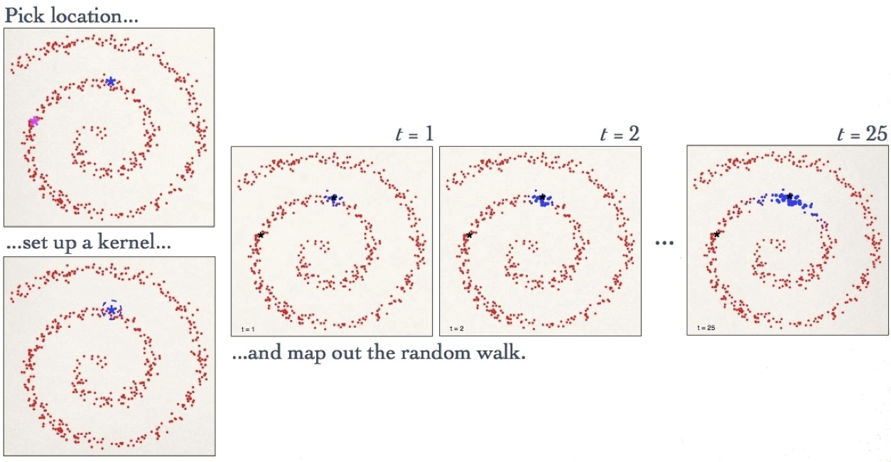

\newcommand{\E}{\mathbb{E}}
\newcommand{\Expect}[1]{\mathbb{E}\left[ #1 \right]}
\newcommand{\Var}[1]{\mathbb{V}\left[ #1 \right]}
\newcommand{\Cov}[2]{\mathrm{Cov}\left[#1,\ #2\right]}
\newcommand{\given}{\ \vert\ }
\renewcommand{\P}{\mathbb{P}}
\newcommand{\argmin}{\arg\min}
\newcommand{\argmax}{\arg\max}
\newcommand{\F}{\mathcal{F}}
\newcommand{\norm}[1]{\left\lVert #1 \right\rVert}
\newcommand{\indicator}{\mathbf{1}}
\renewcommand{\bar}{\overline}
\renewcommand{\hat}{\widehat}
\newcommand{\tr}[1]{\mbox{tr}(#1)}
\newcommand{\X}{X}
\newcommand{\R}{\mathbb{R}}


```{r setup, include=FALSE}
library(knitr)
opts_chunk$set(message=FALSE, warning=FALSE, echo=FALSE,
               fig.align='center',fig.width=10,
               fig.height=6, cache=TRUE, autodep = TRUE)
library(tidyverse)
theme_set(theme_minimal(base_family="Times"))
green = '#00AF64'
blue = '#0B61A4'
red = '#FF4900'
orange = '#FF9200'
colvec = c(green,blue,red,orange)
```

# Motivation

## Overview

Representation learning is the idea that performance of ML methods is
highly dependent on the choice of representation


For this reason, much of ML is geared towards transforming the data into
the relevant features and then using these as inputs


This idea is as old as statistics itself, really,

(e.g. Pearson (1901), where PCA was first introduced)

However, the idea is constantly revisited in a variety of fields and
contexts


Commonly, these learned representations capture 'low level' information
like overall shape types


Other sharp features, such as images, aren't captured


It is possible to quantify this intuition for PCA at least


## PCA

Principal components analysis (PCA) is an (unsupervised) dimension
reduction technique


It solves various equivalent optimization problems

(Maximize variance, minimize $L_2$ distortions, find closest subspace of a given rank,\ldots)

At its core, we are finding linear combinations of the original
(centered) covariates $$Z_{ij} = \alpha_j^{\top} X_i$$


This is expressed via the SVD: $\X - \overline{\X} = UDV^{\top}$ as
$$Z = \X V = UD$$


## Lower dimensional embeddings

Suppose we have predictors $x_1$ and $x_2$

-   We more faithfully preserve the structure of the data by keeping
    $x_1$ and setting $x_2$ to zero than the opposite

```{r, echo=FALSE}
df = data.frame(x=rep(rnorm(20,sd=1),3),y=rep(rnorm(20,sd=.2),3),
                lab = rep(c('data','x2 only','x1 only'),each=20))
df[21:40,1] = 0
df[41:60,2] = 0
ggplot(df,aes(x=x,y=y,color=lab)) + geom_point() + ylim(-2,2) + xlim(-2,2) +
  theme(legend.title = element_blank(), legend.position = 'bottom') +
  ylab('x2') + xlab('x1')
```

## Lower dimensional embeddings

An important feature of the previous example is that $x_1$ and $x_2$ aren't
correlated

What if they are?

```{r, echo=FALSE}
theta = -pi/4
R = matrix(c(cos(theta),sin(theta),-sin(theta),cos(theta)),2)
X = as.matrix(df[1:20,1:2]) %*% R
df2 = data.frame(x=rep(X[,1],3),y=rep(X[,2],3),
                lab = rep(c('data','x2 only','x1 only'),each=20))
df2[21:40,1] = 0
df2[41:60,2] = 0
df2 %>% filter(lab=='data') %>% 
  ggplot(aes(x=x,y=y)) + geom_point() + ylim(-2,2) + xlim(-2,2) +
  theme(legend.title = element_blank(), legend.position = 'bottom') +
  ylab('x2') + xlab('x1')
```

## Lower dimensional embeddings

We lose a lot of structure by setting either $x_1$ or $x_2$ to zero

```{r, echo=FALSE}
df2 %>% 
  ggplot(aes(x=x,y=y,color=lab)) + geom_point() + ylim(-2,2) + xlim(-2,2) +
  theme(legend.title = element_blank(), legend.position = 'bottom') +
  ylab('x2') + xlab('x1')
```

## Lower dimensional embeddings

There isn't that much structurally different between the examples


One is just a rotation of the other

```{r, echo=FALSE}
df3 = bind_rows(df,df2)
df3$version = rep(c('original','rotated'),each=60)
df3 %>% 
  ggplot(aes(x=x,y=y,color=lab)) + geom_point() + ylim(-2,2) + xlim(-2,2) +
  facet_grid(~version)+
  theme(legend.title = element_blank(), legend.position = 'bottom') +
  ylab('x2') + xlab('x1')
```


## PCA

If we knew how to rotate our data, then we could more easily retain the structure.

__PCA__ gives us exactly this rotation


## Optimization

If we want to find the first $K$ principal components, the relevant
optimization program is:
$$\min_{\mu,(\lambda_i),V_K} \sum_{i=1}^n \norm{X_i - \mu - V_K \lambda_i}^2$$

This representation is important

It shows that we are trying to reconstruct lower dimensional representations of the
covariates

## PCA

$$\min_{\mu,(\lambda_i),V_K} \sum_{i=1}^n \norm{X_i - \mu - V_K \lambda_i}^2$$
We can partially optimize for $\mu$ and $(\lambda_i)$ to find

-   $\hat\mu = \overline{X}$

-   $\hat\lambda_i = V_K^{\top}(X_i - \hat \mu)$


We can find
$$\min_{V } \sum_{i=1}^n \norm{(X_i - \hat\mu) - V V^{\top}(X_i - \hat\mu)}^2$$
where $V$ is constrained to be orthogonal

This is the so called Steifel manifold of rank-$K$ orthogonal matrices

The solution is given by the singular vectors $V$

# (General) spectral connectivity analysis

## Metric embeddings

Spectral connectivity analysis (SCA)

* Linear and nonlinear
* Dimension reduction or feature creation
* Examples: PCA, Locally
    linear embeddings, Hessian maps, ~~Laplacian
      eigenmaps~~
* Useful tools in classification, clustering, (regression)

## PCA (review)
  
Collect data: $X_1,\ldots,X_n$ where $X_i\in\R^p$.


1. Center and (scale) the data matrix $\X$
2. Compute the SVD of $\X = U\Sigma V^\top$ or $\X\X^\top = U\Sigma^2U^\top$ or $X^\top X = V\Sigma^2 V^\top$
3. Return $U_d\Sigma_d$, where $\Sigma_d$ is the largest $d$
    eigenvalues of $\X$

* You need to compute SVD of $\X\X^\top$ [or $\X$]


## When PCA works well
  
PCA "works" when the data can be represented (in a lower dimension) as
'lines' (or planes, or hyperplanes). 


So, in two dimensions:  


```{r good-pca, echo=FALSE}
set.seed(12345)
library(mvtnorm)
m = c(2,3)
covmat = matrix(c(1,.75,.75,1),2)
ee = eigen(covmat)
x = rmvnorm(200, m, covmat)
z = apply(x, 1, function(x) sqrt(sum(x^2)))
df = data.frame(x=x[,1], y=x[,2], z=z)
ss = sqrt(ee$values)
df_arrows = data.frame(x1 = m[1], y1 = m[2],
                       x2 = m[1] + ee$vectors[1,]*ss/sum(ss),
                       y2 = m[2] + ee$vectors[2,]*ss/sum(ss))
g <- ggplot(df) + geom_point(aes(x=x,y=y,col=z)) + theme_minimal(base_family = 'serif')
g + scale_color_gradient(low=blue, high=orange) + 
  geom_segment(aes(x=x1,y=y1,xend=x2,yend=y2), data=df_arrows, arrow=arrow())
```

## PCA reduced
  
Here, we can capture a lot of the variation and underlying
'structure' with just 1 dimension, instead of the original 2 (the coloring is for visualizing). 

```{r pca-reduced, echo=FALSE}
xx = scale(x, center=m, scale=FALSE) %*% ee$vectors[,1]
df2 = data.frame(x=xx + m[1], y=xx + m[2], z=z)
g <- ggplot(df2) + geom_point(aes(x=x,y=y,col=z)) + theme_minimal(base_family = 'serif')
g + scale_color_gradient(low=blue, high=orange)
```


## PCA bad

What about other data structures?  Again in two dimensions

```{r spiral, echo=FALSE}
tt = seq(0,4*pi,length=100)
df_spiral = data.frame(x = 3/2*tt*sin(tt), y = 0.5*tt*cos(tt), z=tt)
ee = eigen(crossprod(scale(as.matrix(df_spiral[,1:2]))))
ss = sqrt(ee$values)
df_arrows = data.frame(x1 = 0, y1 = 0,
                       x2 =  ee$vectors[1,]*ss/sum(ss)*10,
                       y2 =  ee$vectors[2,]*ss/sum(ss)*10)
g1 <- ggplot(df_spiral) + geom_point(aes(x=x,y=y,col=z)) + 
  scale_color_gradient(low=blue, high=orange) + 
  geom_segment(aes(x=x1,y=y1,xend=x2,yend=y2), data=df_arrows, arrow=arrow())
g1
```


## PCA bad (2)

Here, we have failed miserably.  

There is actually only 1 dimension
to this data (imagine walking up the spiral going 
from blue to orange).  

However, when we write it as 1 PCA dimension,
all the points are all `mixed up'. 

```{r spiral-reduced}
xx = as.matrix(df_spiral[,1:2]) %*% ee$vectors[,1]
df_spiral2 = data.frame(x=xx, y=xx, z=tt)
g <- ggplot(df_spiral2) + geom_point(aes(x=x,y=y,col=z)) + 
  theme_minimal(base_family = 'serif')
g + scale_color_gradient(low=blue, high=orange)
```

## Explanation
  
* PCA wants to minimize distances (equivalently maximize
    variance).  This means it 'slices' through the data at the
    'meatiest' point, and then the next one, and so on.  If the data are
    'curved' this is going to induce artifacts.  
* PCA also looks at things as being 'close' if they are near each
    other in a Euclidean sense.  
* On the spiral, our intuition says
    that things are 'close' only if the distance is constrained to go
    along the curve.  In other words, purple and blue are close, blue and
    orange are not. 
    
# Nonlinearity and CMDS


## Kernel PCA (KPCA)

Classical PCA comes from
$\tilde{X}= X- MX= UDV^{\top}$, where
$M = \mathbf{1}\mathbf{1}^{\top}/n$ and
$\mathbf{1} = (1,1,\ldots,1)^{\top}$


However, we can just as easily get it from the outer
product
$$\mathbb{K} = \tilde{X}\tilde{X}^{\top} = (I - M)XX^{\top}(I - M) = UD^2U^{\top}$$


The intuition behind KPCA is that $\mathbb{K}$ is an expansion into a
kernel space, where
$$\mathbb{K}_{i,i'} = k( \tilde{X}_i,\tilde{X}_{i'}) = \langle \tilde{X}_i,\tilde{X}_{i'} \rangle$$

__Reminder:__ Anytime we see an
inner product, we can kernelize it

## Kernel PCA

Following this intuition, the approach is simple:

1.  Specify a kernel $k$

    (e.g.
    $k(X,X') = \exp\{ -\gamma^{-1}\left|\left| X - X' \right|\right|_2^2\}$)

2.  Form $K_{i,i'} = k(X_i,X_{i'})$

3.  Standardize and get eigenvector decomposition
    $$\mathbb{K} = (I - M)K(I - M) = UD^2U^{\top}$$


This implicitly finds the inner product:
$$k(X_i,X_{i'}) = \langle \phi(X_i),\phi(X_{i'})\rangle$$ However, we
need only specify the kernel

## Kernel PCA

The scores are still $Z = UD$


The $q^{th}$ KPCA score is (up to centering)
$$Z_{iq} = \sum_{i'=1}^n \beta_{i'q} k(X_i,X_{i'})$$ where
$\beta_{i',q} = u_{i'q}/d_q$

__Note:__ As we don't explicitly
generate the feature map, there are no loadings

## Kernel PCA

__Reminder:__ To get the first PC
in classical PCA, we want to solve
$$\max_\alpha \mathbb{V}\alpha^{\top}X \quad \textrm{ subject to } \quad \left|\left| \alpha \right|\right|_2^2 = 1$$


Translate this into the kernel setting, and we are trying to solve
$$\max_{g \in \mathcal{H}_k} \mathbb{V}g(X) \textrm{ subject to } \left|\left| g \right|\right|_{\mathcal{H}_k} = 1$$
The representer theorem states that a
solution to this problem is
$$\hat{g}(X) = \sum_{i=1}^n \beta_i k(X,X_i)$$

Compare $$Z_{iq} = \sum_{i'=1}^n \beta_{i'q} k(X_i,X_{i'})$$ where
$\beta_{i',q} = u_{i'q}/d_q$

## KPCA example

```{r, echo=FALSE}
n = nrow(df_spiral)
I_M = (diag(n) - tcrossprod(rep(1,n))/n)
kp = (tcrossprod(as.matrix(df_spiral[,1:2])) + 1)^2
Kp = I_M %*% kp %*% I_M
Ep = eigen(Kp, symmetric = TRUE)
polydf = data_frame(
  x=Ep$vectors[,1]*Ep$values[1],
  y=Ep$vectors[,2]*Ep$values[2],
  z = df_spiral$z)
kg = exp(-as.matrix(dist(df_spiral[,1:2]))^2 / 10)
Kg = I_M %*% kg %*% I_M
Eg = eigen(Kg, symmetric = TRUE)
gaussdf = data_frame(
  x=Eg$vectors[,1]*Eg$values[1],
  y=Eg$vectors[,2]*Eg$values[2],
  z = df_spiral$z)
dfkern = bind_rows(df_spiral, df_spiral2, polydf, gaussdf)
dfkern$method = rep(c('data','pca','KPCA poly(2)', 'KPCA gauss(100)'), each=n)
dfkern %>% 
  ggplot(aes(x=x,y=y,color=z)) + geom_point() + 
  facet_wrap(~method,scales = 'free', nrow=2) +
  scale_color_gradient(low=blue, high=orange)
```

## KPCA: summary

Kernel PCA seeks to generalize the notion of
similarity using a kernel map


This can be interpreted as finding smooth,
orthogonal directions in a RKHS


This can allow us to start picking up nonlinear (in the original feature
space) aspects of our data


This new representation can be passed to a
supervised method to form a semisupervised
learner


# Semi-supervised detour

## Basic semi-supervised

1. You get data $\mathcal{D}_{train} = \{(X_1,Y_1),\ldots,(X_n,Y_n)\}$.

2. You do something unsupervised on the $X$'s to create features (like PCA).

3. You use the learned features to find a predictor $\hat{f}$ using the new features.

## Semisupervised learning in practice

Looking at: $$Z_{iq} = \sum_{i'=1}^n \beta_{i'q} k(X_i,X_{i'})$$ this is
only defined at our observed features


Write

-   $\mathcal{D}_{train} = \{(X_1,Y_1),\ldots,(X_n,Y_n)\}$

-   $\mathcal{D}_{test} = \{(X^*_1,Y^*_1),\ldots,(X^*_{n^*},Y^*_{n^*})\}$


Two common scenarios are

1.  We are given $\mathcal{D}_{train}$ and $X^*_1,\ldots,X^*_{n^*}$ to
    build $\hat{f}$

2.  We are given only $\mathcal{D}_{train}$ to build $\hat{f}$

## Case 1

We are given $\mathcal{D}_{train}$ and $X^*_1,\ldots,X^*_{n^*}$ to build
$\hat{f}$


Then we can just use straight forward KPCA

(Or any unsupervised learning step)

1.  Form $\mathbb{K}$ on $\mathcal{D}_{train}$ and
    $X^*_1,\ldots,X^*_{n^*}$

2.  Get $UD$

3.  Pass $Z_q = UD[,1:q]$ to train $\hat{f}$

4.  Get $\hat{Y} = \hat{f}(Z_q)$

## Case 2

We are given only $\mathcal{D}_{train}$ to build $\hat{f}$


Now, we don't know the coordinates of
$X^*_1,\ldots,X^*_{n^*}$ in the representation space


To get a new observation $X^*$ embedded into this representation:
$$Z_0 = D^{-1}U^{\top} (I - M)[k^* - K \mathbf{1}/n]$$ where
$k^* = [k(X^*,X_1),\ldots,k(X^*,X_n)]^{\top}$


Then we compute:

1.  Form $\mathbb{K}$ on $\mathcal{D}_{train}$

2.  Get $UD$

3.  Pass $Z_q = UD[,1:q]$ to train $\hat{f}$

4.  Form $Z_q^*$ for all $X^*_1,\ldots,X^*_{n^*}$

5.  Get $\hat{Y}_{test} = \hat{f}(Z_q^*)$


# Classical multidimensional scaling

## CMDS

A broader class comes from the following procedure (see Figure 4.2 in the text):

1. Calculate a matrix of distances (or dissimilarities) between data points ($\Delta$)

2. Choose some function $\tau: \R\rightarrow\R$ and set $B=\tau(\Delta^2)$.

3. Write $B = U\Sigma U^\top$ (find the eigendecomposition)

4. Approximate your data with $U_{[d]}\Sigma_{[d]}^{1/2}$ where $[d]$ means "the first $d$ columns"

CMDS (I think) is steps 2-4: embedding "dissimilarities" by using the eigendecomposition.


## What I'll call Laplacian Eigenmaps
  
  We can get an estimate of the distance in the unknown geometry that
  the data come from (known as a 'nonlinear' manifold) by altering the
  usual Euclidean distance. 
  
  In this case, I'll use the heat kernel (like most everyone) but this is not necessary.

Distance between $x$ and $y$: 

* PCA:  $\| x-y\|_2$ 

* Laplacian eigenmaps : $\exp\left(-\frac{\|x-y\|_2^2}{\epsilon}\right)$ 


Some notes:

* The name 'Laplacian Eigenmaps' comes from getting the
    eigenvector decomposition of the Laplacian restricted to the
    manifold (which is the second derivative version of the gradient).
    This gives crucial information about its geometry. 

* The form of the distance says that if $\|x-y\|_2^2$ is much
    bigger than $\epsilon$, then the distance is effectively zero.  This
    encodes the idea that things that are 'close' in Euclidean distance
    are 'close' on the manifold as well. 
    
* If the manifold is smooth, then local
    Euclidean distance is an approximation to the distance on the
    manifold.
    
## What is a manifold?

How good of an approximation is Euclidean distance?

This question is equivalent to how asking: how quickly does the
tangent (space) change?


In 1-D, the tangent space is just the first derivative at that point:
$$f(x) = x^2 \Rightarrow f'(x) = 2x.$$

```{r}
quad <- function(x) x^2
ggplot(data.frame(x=c(-1,1)), aes(x)) + stat_function(fun=quad, color=blue) +
  geom_abline(slope = 1, intercept = -.25, color=red)
```

## What is a manifold

Therefore, the quality of the (local) Euclidean distance, depends on the
second derivative

(ie: how fast does the first derivative change?)


In higher dimensions, the second derivative is known as the
__Laplacian__:
$$\sum_{j} \frac{\partial^2 f}{\partial x_j^2}$$ (Note: This is also
known as the divergence of the gradient)

## What are Laplacian Eigenmaps, then?

Imagine the operator $\mathbb{L}$ that performs this operation:
$$\mathbb{L} f = \sum_{j} \frac{\partial^2 f}{\partial x_j^2}$$

Then $\mathbb{L}$ is the __Laplacian__, mapping
a function to the divergence of its gradient


* **Key Idea:**   We can get the eigenvectors/eigenvalues of $\mathbb{L}$. Analogously to PCA, we can now do inference with these eigenvectors.


Note: There is a substantial
overlap with KPCA, the difference being the centering of $K$ and the
row sum versus column sum normalization


## Laplacian Eigenmaps (procedure)

Collect data: $X_1,\ldots,X_n$ where $X_i\in\R^p$.

1. Center and scale the data matrix $\X$
2. Compute $\mathbb{K}$ where
    \[
    \mathbb{K}_{ij} = \exp\left(-\frac{\|X_i-X_j\|_2^2}{\epsilon}\right)
    \]
3. Form the Laplacian $\mathbb{L} = \mathbb{I} -
    \mathbb{M}^{-1}\mathbb{K}$ where $\mathbb{M} =$ `diag(rowSums(`$\mathbb{K}$`))` 
4. Compute the SVD of $\mathbb{L} = U\Sigma U^\top$.
5. Return $U_d\Sigma_d^{-1}$, where $\Sigma_d$ contains the __smallest__ $d$ nonzero
    eigenvalues of $\mathbb{L}$
    
    (Note that the eigenvectors of $\mathbb{L}$ and
      $\mathbb{M}^{-1}\mathbb{K}$ are the same, but $\Sigma(\mathbb{L})
      = \mathbb{I} - \Sigma(\mathbb{M}^{-1}\mathbb{K})$)

* This is basically just CMDS on $\tau(\Delta)$.
* ~~You need to compute SVD of $\mathbb{L}$.~~

## Deeper investigation 1.

The distance matrix

```{r,fig.width=10,fig.height=5}
Delta = as.matrix(dist(df_spiral[,1:2]))
df_Delta = gather(as.data.frame(Delta),key='y')
df_Delta$x = rep(1:n,n)/n
df_Delta = mutate(df_Delta, y= as.numeric(y)/n)
g2 <- ggplot(df_Delta,aes(x=x,y=y,fill=value)) + geom_raster() + 
  scale_fill_gradient(low=blue, high=orange)
gridExtra::grid.arrange(g1,g2,nrow=1)
```


## More deeper

Exponentiate $-\Delta/\gamma$

```{r,fig.width=10,fig.height=5}
K = exp(-Delta^2/.95)
df_K = gather(as.data.frame(K),key='y')
df_K$x = rep(1:n,n)/n
df_K = mutate(df_K, y= as.numeric(y)/n)
g3 <- ggplot(df_K,aes(x=x,y=y,fill=value)) + geom_raster() + 
  scale_fill_gradient(low=blue, high=orange)
gridExtra::grid.arrange(g2,g3,nrow=1)
```

## More deeperer

Form Laplacian: $\mathbb{L} = \mathbb{I} - \mathbb{M}^{-1}\mathbb{K}$

```{r,fig.width=10,fig.height=5}
L = diag(n) - diag(1/rowSums(K)) %*% K
df_L = gather(as.data.frame(L),key='y')
df_L$x = rep(1:n,n)/n
df_L = mutate(df_L, y= as.numeric(y)/n)
g4 <- ggplot(df_L,aes(x=x,y=y,fill=value)) + geom_raster() + 
  scale_fill_gradient(low=blue, high=orange)
gridExtra::grid.arrange(g3,g4,nrow=1)
```


## Diffusion distance

```{r, out.width="1000px"}

```

## Projection 

```{r, out.height="600px"}

```

## Another example

```{r, out.width="1000px"}
include_graphics("gfx/swissRoll.png")
```

<!--

## What goes wrong?

 Collect data: $X_1,\ldots,X_n$ where $X_i\in\R^p$.
  
  You want to perform PCA / Laplacian eigenmaps / LLE / 
  dimension reduction / manifold learning

  $n$, $p$ are Big, like really ~~BIG~~

  You have some problems: 
  
  1. The matrices $\X\X^\top$ or $\mathbb{L}$ may be hard to store
  2. Computing the SVD of either is an $O(n^3)$ operation
    (for PCA, it is $O(\min\{np^2,p^3\})$, but both are big)
    
# Approximation: Can we compute the SVD approximately and still do a good job?


## Nystr&ouml;m extension
  
  Based on a technique for finding a numerical solution for
  integral equations
  
  Very similar to out-of-sample embedding
  
  
  Algorithm (briefly)
  
  1. Subsample $\L$: choose $M\subset \{1,\ldots,n\}$ such
      that $|M|=m$, $m \ll n$
      \[
      \widetilde{\L} := \L_{M,M}
      \]
  2. Compute eigendecomposition of $\widetilde{\L}=\widetilde{U}\widetilde{\Sigma}\widetilde{U}^\top$
  3. "Extend" $\widetilde{U}$ via simple formula to create $U^{nys}$
      
      Write 
      \[
      \begin{aligned}
        \L &= \begin{bmatrix} \L_{M,M} & \L_{12}\\ \L_{21} & \L_{22} \end{bmatrix}
        & U^{nys} &= \begin{bmatrix} \widetilde{U}\\ \L_{21}\widetilde{U}\widetilde{\Sigma}^{-1}
        \end{bmatrix}
      \end{aligned}
      \]


Requires only O$(nm^2)$ computations


## Gaussian projection

Produces an orthonormal matrix $Q$ which approximates col$(W)$

1. Draw $n\times m$ Gaussian random matrix $\Omega$.
2. Form $Y = \L \Omega$.
3. Construct $Q$, an orthonormal matrix such that col$(Q)$ = col$(Y)$
4. Form $B$ such that $B$ minimizes  $|| BQ^{\top}\Omega - Q^{\top}Y||_2$
5. Compute the eigenvector decomposition of $B$, ie: $B = \widehat U \widehat \Sigma \widehat U^{\top}$ 
6. Return $U^{gp} = Q \widehat U$.
    
    
* Requires O$(n^2m)$ computations 
* remains orthonormal

(Steps 3 and 4 with QR decomposition)

see Halko, Martinsson, and Tropp (2009)


# Implementation

## Here's our true manifold.

```{r elephant, echo=FALSE}
tt = -100:500/100
elephant <- function(tt,eye=TRUE){
  x = 12*cos(3*tt) - 14*cos(5*tt) + 50*sin(tt) + 18*sin(2*tt)
  y = -30*sin(tt) + 8*sin(2*tt) - 10*sin(3*tt) - 60*cos(tt)
  if(eye) return(data.frame(y=c(y,20),x=c(-x,20)))
  else return(data.frame(y=y,x=-x))
}
ele = elephant(tt)
ele$tt = c(tt,-2)
ggplot(ele, aes(x=y,y=x,col=tt)) + geom_point() + theme_minimal(base_family = 'serif') +
  scale_color_gradient(low=blue, high=orange)
```


## Data

```{r elephant-data, echo=FALSE}
n = 250
tt = runif(n,-1,5)
dele = elephant(tt,FALSE)+rnorm(n,0,2)
dele$tt = tt
ggplot(dele, aes(x=y,y=x,col=tt)) + geom_point() + theme_minimal(base_family = 'serif') +
  scale_color_gradient(low=blue, high=orange)
X = as.matrix(dele[,1:2])
```


## PCA

```{r pca-elephant, echo=TRUE}
Xbar = colMeans(X)
Xc = scale(X, center=Xbar, scale=FALSE) ## Decided not to scale
ee = eigen(tcrossprod(Xc))
Xhat = ee$vectors[,1] * sqrt(ee$values[1])
df_to_plot = data.frame(x=Xhat+Xbar[1], y=Xhat+Xbar[2], z=tt)
ggplot(df_to_plot, aes(x=y,y=x,col=tt)) + geom_point() + 
  theme_minimal(base_family = 'serif') +
  scale_color_gradient(low=blue, high=orange)
```

Not too good.

## Approximate PCA?

Not really necessary since $p$ is small. But we do it anyway.

```{r pca-elephant-approx, echo=TRUE}
select = sample.int(nrow(X), floor(nrow(X)/2))
Xsmall = X[select,]
Xrest = X[-select,]
Xbarsmall = colMeans(Xsmall)
Xcsmall = scale(Xsmall, center=Xbar, scale=FALSE) ## Decided not to scale
ee = eigen(tcrossprod(Xcsmall))
L21 = tcrossprod(scale(Xrest, center=Xbarsmall, scale=FALSE), Xcsmall)
Xhat = c(ee$vectors[,1], L21 %*% ee$vectors[,1]/ee$values[1]) * sqrt(ee$values[1])
df_to_plot = data.frame(x=Xhat+Xbarsmall[1], y=Xhat+Xbarsmall[2], z=tt)
ggplot(df_to_plot, aes(x=y,y=x,col=tt)) + geom_point() + 
  theme_minimal(base_family = 'serif') +
  scale_color_gradient(low=blue, high=orange)
```

## Laplacian eigenmaps

```{r le-elephant, echo=TRUE}
Dmat = as.matrix(dist(Xc))^2
K = exp(-Dmat/150) ## Why 150??
K[K<.1] = 0 ## sometimes this helps
L = diag(nrow(K)) - diag(1/rowSums(K)) %*% K
ee = eigen(L)
tail(ee$values,10)
last = which.min(ee$values[ee$values>1e-12])
Xhat = ee$vectors[,last] / ee$values[last]
df_to_plot = data.frame(x=Xhat+Xbar[1], y=Xhat+Xbar[2], z=tt)
ggplot(df_to_plot, aes(x=x,y=y,col=tt)) + geom_point() + 
  theme_minimal(base_family = 'serif') +
  scale_color_gradient(low=blue, high=orange)
```

Still not great. (Try as I might)

## Approximate LE?


```{r le-elephant-approx, echo=TRUE}
Ks = K[select,select]
ls = length(select)
Ls = diag(ls) - diag(1/rowSums(Ks)) %*% Ks
ee = eigen(Ls)
ee$values = Re(ee$values) ##!
ee$vectors = Re(ee$vectors)
tail(ee$values)
last = which.min(ee$values[ee$values>1e-12])
L21 = L[-select,select]
Xhat = c(ee$vectors[,last], L21 %*% ee$vectors[,last]/ee$values[last]) / ee$values[last]
df_to_plot = data.frame(x=Xhat+Xbar[1], y=Xhat+Xbar[2], z=tt)
ggplot(df_to_plot, aes(x=y,y=x,col=tt)) + geom_point() + 
  theme_minimal(base_family = 'serif') +
  scale_color_gradient(low=blue, high=orange)
```

Pretty bad. I think I screwed something up.


## Conclusions


1. Tuning parameter selection is critical
2. Construction of $\mathbb{K}$ is important: different similarity measures lead to drastically different solutions, often garbage
3. Gaussian projection gives orthogonal features (might work better in the LE result above)
4. Need some targeted theory

-->

# Clustering whirlwind

# K-means

## K-means

1.  Select a number of clusters $K$.

2.  Let $C_1,\ldots,C_K$ partition $\{1,2,3,\ldots,n\}$ such that

    -   All observations belong to some set $C_j$.

    -   No observation belongs to more than one set.

3.  K-means attempts to form these sets by making [within-cluster
    variation]{style="color: orangemain"}, $W(C_k)$, as small as
    possible. $$\min_{C_1,\ldots,C_K} \sum_{k=1}^K W(C_k).$$

4.  To Define $W$, we need a concept of distance. By far the most common
    is Euclidean
    $$W(C_k) =  \frac{1}{|C_k|} \sum_{i,i' \in C_k} \norm{X_i - X_{i'}}_2^2.$$
    That is, the average (Euclidean) distance between all cluster
    members.

## K-means

It turns out $$\min_{C_1,\ldots,C_K} \sum_{k=1}^K W(C_k).$$ is too hard
of a problem to solve computationally ($K^n$ partitions!).


So, we make a greedy approximation:

1.  Randomly assign observations to the $K$ clusters

2.  Iterate until the cluster assignments stop changing:

    -   For each of $K$ clusters, compute the
        centroid, which is the $p$-length
        vector of the means in that cluster.

    -   Assign each observation to the cluster whose centroid is closest
        (in Euclidean distance).

This procedure is guaranteed to decrease (1) at each step.

## K-means: A Summary

To fit K-means, you need to

1.  Pick $K$ (inherent in the method)

2.  Convince yourself you have found a good solution (due to the
    randomized approach to the algorithm).


It turns out that 1. is difficult to do in a
principled way. We will discuss this next

For 2., a commonly used approach is to run
K-means many times with different starting points. Pick the solution
that has the smallest value for
$$\min_{C_1,\ldots,C_K} \sum_{k=1}^K W(C_k)$$


## Choosing the Number of Clusters

Why is it important?

-   It might make a big difference (concluding there are $K = 2$ cancer
    sub-types versus $K = 3$).

-   One of the major goals of statistical learning is automatic
    inference. A good way of choosing $K$ is certainly a part of this.

## Reminder: What does $K$-means do?

Given a number of clusters $K$, we (approximately) minimize:
$$\sum_{k=1}^K W(C_k) 
%= \sum_{k=1}^K \frac{1}{|C_k|} \sum_{i,i' \in C_k} \sum_{j=1}^p (x_{ij} - x_{i'j})^2 
= \sum_{k=1}^K\frac{1}{|C_k|} \sum_{i,i' \in C_k} ||X_i - X_{i'}||_2^2.$$
We can rewrite this in terms of the
centroids as
$$W(K) = \sum_{k=1}^K  \sum_{i \in C_k}  ||X_i - \overline{X}_k||_2^2,$$

## Minimizing $W$ in $K$

Of course, a lower value of $W$ is better. Why not minimize $W$?

Within-cluster variation measures how tightly
grouped the clusters are. 

As we increase
$K$, this will always decrease.

What we are missing is between-cluster
variation, ie: how spread apart the groups
are $$B = \sum_{k=1}^K |C_k| ||\overline{X}_k - \overline{X} ||_2^2,$$
where $|C_k|$ is the number of points in $C_k$, and $\overline{X}$ is
the grand mean of all observations:
$$\overline{X} = \frac{1}{n} \sum_{i=1}^n X_i.$$


Sadly, just like $W$ can be made arbitrarily small, $B$ will always
be increasing with increasing $K$.


## $CH$ index

Ideally, we would like our cluster assignment to
simultaneously have small $W$ and large
$B$.

This is the idea behind __$CH$ index__. For
clustering assignments coming from $K$ clusters, we record $CH$ score:
$$CH(K) = \frac{B(K)/(K-1)}{W(K)/(n-K)}$$ To choose $K$, pick some
maximum number of clusters to be considered ($K_{\max} = 20$, for
example) and choose the value of $K$ that
$$\hat K = \argmax_{K \in \{ 2,\ldots, K_{\max} \}} CH(K).$$

__Note:__ $CH$ is undefined for $K =1$ (see Calinski, Harabasz, 1974)


## Dumb example

* There are 2 clusters

```{r}
set.seed(12345)
library(mvtnorm)
X1 = rmvnorm(30,c(-1,2),sigma=matrix(c(1,.5,.5,1),2))
X2 = rmvnorm(20,c(2,-1),sigma=matrix(c(1.5,.5,.5,1.5),2))
clust_raw = rbind(X1,X2)
clust = tibble(x=clust_raw[,1],y=clust_raw[,2],
               true = as.factor(rep(c(1,2), times=c(30,20))))
clust %>% ggplot(aes(x=x,y=y,color=true)) + geom_point() +
  theme(legend.position = 'none')
```

## Dumb example

* Within, between, and CH index
* We would __maximize__ CH

```{r}
K = 2:40
all_clusters <- lapply(K, FUN = function(x){
  out = kmeans(clust_raw,x)
  list(assignments = out$cluster, withinss = out$tot.withinss,
              betweenss = out$betweenss)
})
all_assignments = sapply(all_clusters, FUN = function(x) as.factor(x$assignments))
summaries = sapply(all_clusters, FUN = function(x) c(x$withinss, x$betweenss))
summaries = tibble('within'=summaries[1,],'between'=summaries[2,],'K'=K) %>% 
  mutate(CH = (between/(K-1))/(within/(50-K)))
summaries %>% gather(key='key',value='value',-K) %>%
  ggplot(aes(K,value)) + geom_line(color=blue) + facet_wrap(~key,ncol=3,scales='free_y') 
```

## Dumb example

* Various solutions

```{r}
all_assignments = all_assignments %>% as_tibble()
names(all_assignments) = paste0('K=',K)
small_assignments = all_assignments[,c(1,2,4,9,14,19,29,39)]
bind_cols(small_assignments, clust) %>% 
  gather(key='key',value='value',-x,-y) %>%
  ggplot(aes(x,y,color=value)) + geom_point() + facet_wrap(~key) +
  theme(legend.position = 'none')
```

# Hierarchical clustering

## From $K$-means to hierarchical clustering

Recall two properties of $K$-means
clustering

1.  It fits exactly $K$ clusters.

2.  Final clustering assignments depend on the chosen initial cluster
    centers.


Alternatively, we can use hierarchical
clustering. This has the advantage that

1.  No need to choose the number of clusters before hand.

2.  There is no random component (nor choice of starting point).


There is a catch: we need to choose a way to measure the distance
between clusters, called the __linkage__.


Given the linkage, hierarchical clustering produces a sequence of
clustering assignments.


At one end, all points are in their __own__
cluster.


At the other, all points are in __one__
cluster.


In the middle, there are __nontrivial__
solutions.

## Agglomerative example


```{r}
set.seed(1)
x1 = runif(7)
x1[1:3] = x1[1:3] + 1
x2 = runif(7,0,2)
tiny = tibble(x1=x1,x2=x2) %>% arrange(x2)
tiny$true = factor(c(2,2,2,1,1,1,1))
g <- ggplot(tiny, aes(x=x1,y=x2)) + geom_point(aes(color=true)) + 
   theme(legend.position = 'none')
g + geom_text(label=1:7,nudge_x =.1,nudge_y = .1)
```

Given these data points, an agglomerative algorithm chooses a cluster sequence by combining the points into groups.

We can also represent the sequence of clustering assignments as a
dendrogram

Cutting the dendrogram horizontally partitions the data points
into clusters


## Linkages

Notation: Define $X_1,\ldots, X_n$ to be the data


Let the dissimiliarities be $d_{ij}$ between
each pair $X_i, X_j$


At any level, clustering assignments can be expressed by sets
$G = \{ i_1, i_2, \ldots, i_r\}$. given the
indices of points in this group. Define
$|G|$ to be the size of $G$.


__Linkage:__ The function $d(G,H)$ that takes
two groups $G,H$ and returns the linkage
distance between them.


Agglomerative clustering, given the linkage:

-   Start with each point in its own group

-   Until there is only one cluster, repeatedly merge the two groups
    $G,H$ that minimize $d(G,H)$.

## Single linkage

In __single linkage__ (a.k.a nearest-neighbor
linkage), the linkage distance between $G,H$ is the smallest
dissimilarity between two points in different groups:
$$d_{\textrm{single}}(G,H) = \min_{i \in G, \, j \in H} d_{ij}$$


Example: 

```{r}
seg = function(a,b){
  o = bind_cols(tiny[a,1:2],tiny[b,1:2])
  names(o) = c('x','y','xend','yend')
  o
}
g + geom_segment(aes(x=x,y=y,xend=xend,yend=yend),data = seg(3,4))
```


## Complete linkage

In __complete linkage__ (i.e. farthest-neighbor
linkage), linkage distance between $G,H$ is the
largest dissimilarity between two points in
different clusters:
$$d_{\textrm{complete}}(G,H) = \max_{i \in G,\, j \in H} d_{ij}.$$


Example:
```{r}
g + geom_segment(aes(x=x,y=y,xend=xend,yend=yend),data = seg(2,5))
```


## Average linkage

In __average linkage__, the linkage distance
between $G,H$ is the average dissimilarity
over all points in different clusters:
$$d_{\textrm{average}}(G,H) = \frac{1}{|G| \cdot |H| }\sum_{i \in G, \,j \in H} d_{ij}.$$


Example:

```{r}
g + geom_segment(aes(x=x,y=y,xend=xend,yend=yend),
                 data = seg(rep(1:3,times=4),rep(4:7,each=3)))
```


## Common properties

Single, complete, and average linkage share the following:

-   They all operate on the dissimilarities $d_{ij}$. This means that
    the points we are clustering can be quite general (number of
    mutations on a genome, polygons, faces, whatever).

-   Running agglomerative clustering with any of these linkages produces
    a dendrogram with no inversions


- No inversions means that the linkage distance between merged clusters
only increases as we run the algorithm.


In other words, we can draw a proper dendrogram, where the height of a
parent is always higher than the height of either daughter.

(We'll return to this again shortly)

## Centroid linkage

__Centroid linkage__ is a commonly used and
relatively new approach. Assume

-   $X_i \in \mathbb{R}^p$

-   $d_{ij} = ||X_i - X_j||_2^2$


Let $\overline{X}_G$ and $\overline{X}_H$ denote group averages for
$G,H$. Then
$$d_{\textrm{centroid}} = ||\overline{X}_G - \overline{X}_H||_2^2$$

Example: 

```{r}
tf = tiny %>% group_by(true) %>% summarize(mx = mean(x1), my = mean(x2)) 
tff = bind_cols(tf[1,2:3],tf[2,2:3])
names(tff) = c('x','y','xend','yend')
g + geom_segment(aes(x=x,y=y,xend=xend,yend=yend),data = tff) + 
  geom_point(data=tf, aes(x=mx,y=my,color=true), shape=1,size=5)
```

## Centroid linkage

Centroid linkage is

-   ... quite intuitive

-   ... nicely analogous to $K$-means.

-   ... very related to average linkage (and much, much faster)

However, it has may introduce inversions.
__inversions__


## Shortcomings of some linkages

* __Single__: suffers from chaining:  a single pair of close points merges two clusters. Therefore, clusters can be too spread out and not compact enough.

* __Complete linkage:__   suffers from crowding: a point can be closer to points in
other clusters than to points in its own cluster. Therefore, the clusters are
compact, but not far enough apart.

* __Average linkage:__ tries to strike a balance between these two. But...

    - It isn't clear what properties the resulting clusters have when we
    cut an average linkage tree.

    -   Results of average linkage clustering can change with a monotone
    increasing transformation of the dissimilarities (that is, if we
    changed the distance, but maintained the ranking of the distances,
    the cluster solution could change).

    - Neither of these problems afflict single or complete linkage.

* __Centroid linkage:__ 

    - same monotonicity problem
    - still the cut issues
    - and inversions
    
## Distances

Note how all the clustering depends on the distance functions.

Can do lots of things besides Euclidean

This is very important

```{r}
tt = seq(0,2*pi,len=50)
tt2 = seq(0,2*pi,len=75)
c1 = data.frame(x=cos(tt),y=sin(tt),grp=1)
c2 = data.frame(x=1.5*cos(tt2),y=1.5*sin(tt2),grp=2)
circles = bind_rows(c1,c2)
ggplot(circles,aes(x=x,y=y,color=as.factor(grp))) + geom_point() + 
  theme(legend.position = 'none')
```