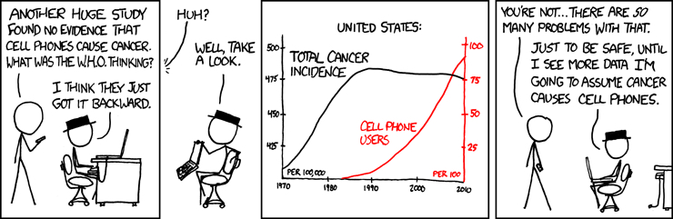
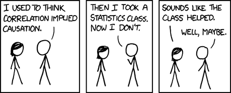
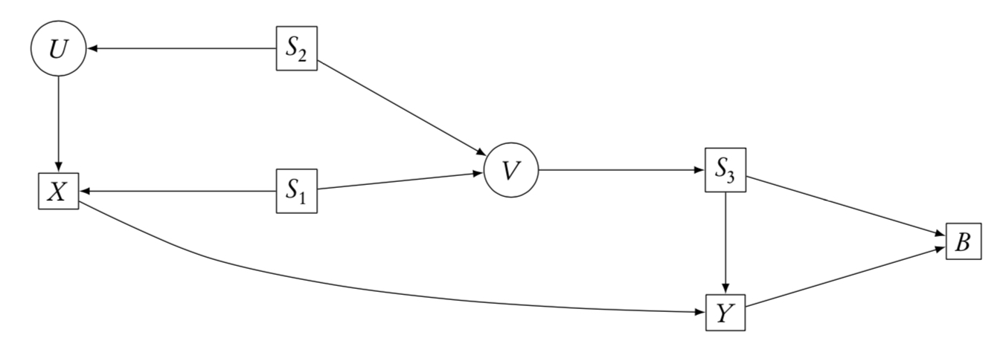
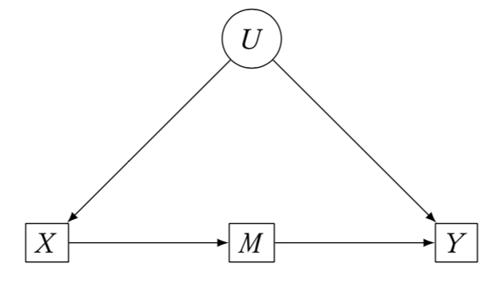
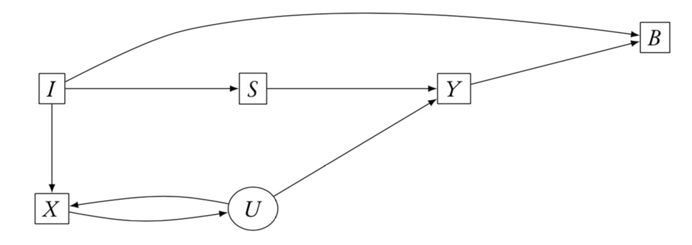
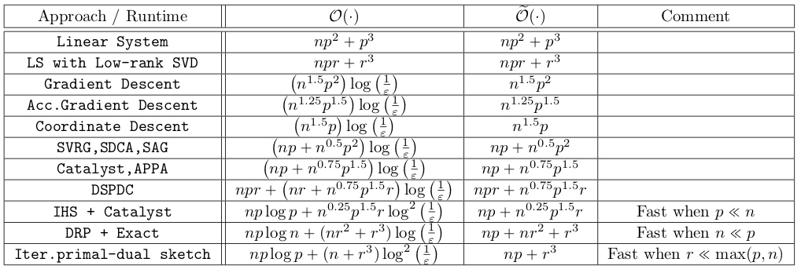

\newcommand{\E}{\mathbb{E}}
\newcommand{\Expect}[1]{\mathbb{E}\left[ #1 \right]}
\newcommand{\Var}[1]{\mathbb{V}\left[ #1 \right]}
\newcommand{\Cov}[2]{\mathrm{Cov}\left[#1,\ #2\right]}
\newcommand{\given}{\ \vert\ }
\renewcommand{\P}{\mathbb{P}}
\newcommand{\argmin}{\arg\min}
\newcommand{\argmax}{\arg\max}
\newcommand{\F}{\mathcal{F}}
\newcommand{\norm}[1]{\left\lVert #1 \right\rVert}
\newcommand{\indicator}{\mathbf{1}}
\renewcommand{\bar}{\overline}
\renewcommand{\hat}{\widehat}
\newcommand{\tr}[1]{\mbox{tr}(#1)}
\newcommand{\X}{X}
\newcommand{\R}{\mathbb{R}}
\newcommand{\set}[1]{\texttt{set}(#1)}
\def\indep{\perp\!\!\!\perp}
\def\notindep{\not\!\perp\!\!\!\perp}


```{r setup, include=FALSE}
library(knitr)
opts_chunk$set(message=FALSE, warning=FALSE, echo=FALSE,
               fig.align='center',fig.width=10,
               fig.height=6, cache=TRUE, autodep = TRUE)
library(tidyverse)
theme_set(theme_minimal(base_family="Times"))
green = '#00AF64'
blue = '#0B61A4'
red = '#FF4900'
orange = '#FF9200'
colvec = c(green,blue,red,orange)
```

# Causal inference

# Introduction

## Source and thanks

Much of this material comes from Larry Wasserman's lecture in "Statistical Machine Learning 10-702" at CMU.

Some additions come from Cosma Shalizi's textbook [Advanced Data Analysis from an Elementary Point of View](http://www.stat.cmu.edu/~cshalizi/ADAfaEPoV/).

## Prediction vs. causation

These two are very different.

* Prediction: Predict $Y$ after __observing__ $X=x$
* Causation: Predict $Y$ after __setting__ $X=x$

Example:

* Prediction: Predict health given that a person eats beets.
* Causation: Predict health if I give someone beets.

The first case is simply observational while the second relies on an intervention.

Analysis requires different techniques, and often strong assumptions.

## Two types of causal questions

~~Type I:~~

Do cell phones cause brain cancer?

In mathematical terms, there are variables $X$ and $Y$ and we want to determine the causal effect of $X$ on $Y$.

Procedure: find a parameter $\theta$ that measures this effect and try to estimate it.

Called __causal inference__

~~Type II:~~

I have a pile of variables and I want to discern their causal relationships.

Called __causal discovery__

Larry argues that solving this problem is statistically impossible. 

Lots of people work on this problem however.

## Two types of data

~~Type I:~~

Data from randomized, controlled experiments.

The inference problem is straightforward (well-defined).

~~Type II:~~

Data from observational studies.

The inference problem is difficult, requires making assumptions and using domain knowledge.

## Three languages

1. Counterfactuals
2. Causal graphs 
3. Structural equation models

These are essentially equivalent up to minor details.

## Motivation for different notation

* Height and reading ability are associated.

* Stretching a child will not improve reading ability.

* Height does not __cause__ improved reading skill.

* Smoking causes cancer.

* Society is pretty confident that giving people cigarettes will give them cancer.

\[
P(Y\given X=x) \quad\quad\quad \textrm{v.s.} \quad\quad\quad P(Y\given \set{X=x})
\]

Correlation is not causation in math
\[
P(Y\given X=x) \neq P(Y\given \set{X=x})
\]

---

```{r}

```


---

```{r}

```


## Main messages

1. Causal effects can be estimated consistently from randomized experiments.
2. It is difficult to estimate causal effects from observational (non-randomized) experiments.
3. All causal conclusions from observational studies should be regarded as very tentative.

As with many of the topics we've examined, we will merely scratch the surface.

# Counterfactuals

## Treatment effects

* We get to see $Y$, the "response" or "outcome"
* We also get to see $X$, the "treatment"
* For a given subject, $(X_i,Y_i)$, we only see the $Y_i$ at the particular $X_i$.
* We don't get to see that same individual's outcome at a different $X_i$.
* That is, we don't know how their outcome would change if we changed their treatment.
* The __counterfactual__ is how $Y$ varies for different values of treatment.

```{r}
df = data.frame(X=1:5, Y=1:5)
g1 = ggplot(df, aes(X,Y)) + geom_point() + ylim(-1,6) + xlim(-1,6) +
  theme(axis.text = element_blank(), panel.grid = element_blank()) +
  geom_hline(yintercept = 0) + geom_vline(xintercept = 0)
g2 = g1 + geom_abline(slope = -1, intercept = 1:5*2, linetype = 'dotted')
library(gridExtra)
grid.arrange(g1,g2,nrow=1)
```

## Simplification

* Assume $X$ is binary. (for ease, doesn't change anything)

* $X=1$ means treated, $X=0$ means not

* $\Expect{Y\given X=x}$ is what we want for prediction.

* Let 
\[ 
Y = 
\begin{cases}
Y_1 & X = 1\\ Y_0 & X=0.
\end{cases}
\]

* Thus, $Y=XY_1+(1-X)Y_0$. That's what we see.

* $(Y_0,Y_1)$ are called __potential outcomes__, but we only see one of them, not both.

* The one we don't see is the counterfactual.

## Example data

```{r}
data.frame(X = c(1,1,1,1,0,0,0,0),
           Y = c(1,0,1,1,0,1,0,0),
           Y0 = c('*','*','*','*',0,1,0,0),
           Y1 = c(1,0,1,1,'*','*','*','*')) %>%
  kable() 
```

* We see only $X$ and $Y$.
* The asterisks are unobserved

## Causal inference

* We want the effect of the treatment.

* This involves the distribution $p(y_1,y_0)$.

* For example the __mean treatment effect__ or __mean causal effect__ is
\[
\theta = \Expect{Y_1}-\Expect{Y_0} = \Expect{Y\given \set{X=1}} - \Expect{Y\given \set{X=0}}
\]

__Lemma__
\[ 
\Expect{Y_1} \neq \Expect{Y\given X=1} \quad\quad\quad \Expect{Y_0} \neq \Expect{Y\given X=0}
\]

## What can we estimate?

In general, we cannot estimate $\theta$.

We can estimate $\alpha = \Expect{Y\given X=1} - \Expect{Y\given X=0}$.

But these are not equal.

__Theorem__ [@RobinsScheines2003]:  
Let $\mathcal{P}$ be that set of distributions for $(X,Y_0,Y_1,Y)$ where $P(X=0)>\delta$ and $P(X=1)>\delta$ for some $\delta>0$. Then there is no estimator $\hat{\theta}$ which depends only on $(X,Y)$ such that for all $\epsilon>0$,
\[
\sup_{P\in\mathcal{P}} P\left(|\hat{\theta}_n-\theta|>\epsilon\right) \xrightarrow{n\rightarrow\infty} 0.
\]

__Proof:__ Simply construct $p(x,y_0,y_1)$ and $q(x,y_0,y_1)$ such that $\theta(p) \neq \theta(q)$ but $p(x,y) = q(x,y)$.

If $X$ is continuous, the we care about $\theta(x) = \Expect{Y\given \set{X=x}} \neq \Expect{Y\given X=x}$.

## Ways to make the thing estimable

1. Randomization
2. Adjusting for confounding
3. Instrumental variables

## Randomization

If we randomly assign $X=0$ or $X=1$, then
\[
(Y_0,Y_1) \indep X.
\]

Note: $X$ is __not__ independent of $Y$.

__Theorem:__  
Let $\mathcal{P}$ be that set of distributions where $P(X=0)>\delta$ and $P(X=1)>\delta$ for some $\delta>0$ and $X$ is assigned randomly. Then $\theta=\alpha$ and
\[
\hat{\alpha} = \frac{\sum X_iY_i}{\sum X_i} - \frac{\sum (1-X_i)Y_i}{\sum (1-X_i)}
\]
satisfies (for all $\epsilon >0$)
\[
\sup_{P\in\mathcal{P}} P\left(|\hat{\alpha}_n-\theta|>\epsilon\right) \xrightarrow{n\rightarrow\infty} 0.
\]

In summary, under random assignment, correlation $=$ causation.

The same holds if $X$ is continuous: you can use regression to estimate causal effects.

## Adjusting for confounding

* This requires strong assumptions.

* Without randomization, we don't have $(Y_0,Y_1) \indep X$.

* The hope is that there are some additional variables $Z$ such that
\[
(Y_0,Y_1) \indep X \given Z
\]

* This condition is referred to as __ignorability__ or a lack of __unmeasured confounding__

* If you proceed in this manner, you must assert that the above condition holds.

## Main result

__Theorem:__  
If $(Y_0,Y_1) \indep X \given Z$, then
\[
\theta = \int \mu(1,z)p(z)dz - \int \mu(0,z)p(z)dz
\]
where $\mu(x,z) = \Expect{Y\given X=x,\ Z=z}$. A consistent estimator of $\theta$ is
\[
\hat{\theta} = \frac{1}{n}\sum \left(\hat{\mu}(1,Z_i) - \hat{\mu}(0,Z_i)\right)
\]
where $\hat{\mu}$ is a consistent estimator of $\Expect{Y\given X=x,\ Z=z}$.

* One needs to estimate $\mu$ semi-parametrically.

* The bias-variance tradeoff for estimating $\mu$ is not appropriate. You want lower bias and larger variance. This choice is not well understood.

* This is different than
\[
\alpha = \Expect{Y\given X=1} - \Expect{Y\given X=0} = \int \mu(1,z)p(z\given X=1)dz - \int \mu(0,z)p(z\given X=0)dz
\]

## Linearity

If   
1. $X$ is binary and  
2. $(Y_0,Y_1) \indep X \given Z$ and  
3. $\Expect{Y\given X=x, Z=z} = \beta_0 + \beta_1 x + \beta_2^\top z$, then
\[
\theta = \beta_1.
\]

# Causal graphical models

## DAGs

```{r,fig.height=6,fig.width=6}
library(igraph)
library(network)
mat = matrix(0,nrow=7,ncol=7)
mat[1,2] <- mat[1,4] <- mat[1,6] <- mat[2,3] <- 1
mat[3,5] <- mat[4,7] <- mat[5,7] <- mat[6,7] <- 1
net = graph_from_adjacency_matrix(mat, mode="directed")
names_mat <- c("health_conscious","tooth_brushing","gum_disease",
                                    "exercise","inflamation", "diet", "heart_disease")
V(net)$color = RColorBrewer::brewer.pal(3,'Set2')[c(0,1,0,0,0,0,2)+1]
plot(net, edge.arrow.size=.4,vertex.size=30,
     vertex.label = names_mat, vertex.label.color='black')
```

* DAGs imply conditional independence relationships

* p(heart disease) = p(health consciousness) p(brushing | health) p(exercise | health)
p(diet | health) $\times$   
p(gum disease | brushing) p(inflamation | gum disease) p(heart disease | diet, exercise, inflamation)

* (the last term factors too)

* Nodes are conditionally independent of everything given their parents

* We want to know if better brushing decreases heart disease


## Causal DAGs

```{r,fig.height=6,fig.width=6}
net = delete_edges(net, 1|2)
plot(net, edge.arrow.size=.4,vertex.size=30,
     vertex.label = names_mat, vertex.label.color='black')
```

1. Remove arrows into brushing.  
2. Set brushing equal to the intervention.  
3. Calculate the new distribution of heart disease.

\[
\begin{aligned}
& p(y \given \set{X=x}) = \int p(z)p(y\given x,z)dz\\
\Rightarrow & p(y \given \set{X=1}) - p(y \given \set{X=0}) = \int p(z)p(y\given 1,z)dz - \int p(z)p(y\given 0,z)dz
\end{aligned}
\]

This is equivalent to the counterfactual representation.

\[
\begin{aligned}
\theta &= \Expect{Y \given \set{X=1}} - \Expect{Y \given \set{X=0}}\\
 &= \int \int yp(z)p(y\given 1,z)dzdy - \int \int yp(z)p(y\given 0,z)dzdy\\
 &= \int \mu(1,z)p(z)dz - \int \mu(0,z)p(z)dz.
\end{aligned}
\]

## Structural equation models

```{r,fig.height=4,fig.width=4}
simp = matrix(0, 3, 3)
simp[1,2] <- simp[2,3] <- simp[1,3] <- 1
simp = graph_from_adjacency_matrix(simp, mode="directed")
plot(simp, edge.arrow.size=.4,vertex.size=30, vertex.color = 'steelblue',
     vertex.label = c('Z','X','Y'), vertex.label.color='black')
```

* SEMs are equivalent to graphical models.

* Write
\[
\begin{aligned}
Z &= g_1(U)\\
X &= g_2(Z,V)\\
Y &= g_3(Z,X,W)
\end{aligned}
\]
for some (independent) variables $U,V,W$ and some functions $g_1,g_2,g_3$

* Deleting the edge between $Z$ and $X$ and intervening is just replacing $g_2(Z,V)$ with $X=x$.

## Pitfall

It is not enough to "just condition on everything".

```{r,fig.height=4,fig.width=4}
simp = matrix(0, 3, 3)
simp[2,1] <- simp[2,3] <- simp[3,1] <- 1
simp = graph_from_adjacency_matrix(simp, mode="directed")
plot(simp, edge.arrow.size=.4,vertex.size=30, vertex.color = 'steelblue',
     vertex.label = c('Z','X','Y'), vertex.label.color='black')
```

* $P(Y \given X=x) = P(Y \given \set{X=x})$.
* $P(Y \given X=x, Z=z) \neq P(Y \given X=x)$.
* If we remove the arrow from $X\rightarrow Y$, we still have a problem because $Y$ and $X$ are dependent conditional on $Z$, but have no direct causal relationship.

## Identification strategies

1. "back door criterion"
2. "front door criterion"
3. "instrumental variable"

Note that all of these require "knowing" the graph and measuring appropriate variables.

Even then, we then have to solve difficult estimation problems or make strong assumptions.

## The back door (identification by conditioning)

```{r, out.width="50%"}

```

* We want to condition on a set of variables that blocks (undirected) paths between $X$ and $Y$ with an arrow __into__ $X$. 

* If a set $S$ achieves this, and no node in $S$ is a descendent of $X$, then
\[
P(Y\given \set{X=x}) = \sum_s P(Y\given X=x, S=s)P(S=s)
\]

* We estimate the terms on the right.

__Examples__  
1. $S=\{S_1,S_2\}$  
2. $S=\{S_3\}$  
3. $S=\{S_1,S_2,S_3\}$  

If we add $B$ to any of these, it breaks.

## The front door (identification by mechanisms)

```{r, out.width="50%"}

```

* If A set of variables $M$  

    1. Blocks all directed paths from $X$ to $Y$.
    2. Has no unblocked back door paths from $X$ to $M$.
    3. $X$ Blocks all back door paths from $M$ to $Y$.
    
* Then,
\[
P(Y\given \set{X=x}) = \sum_m P(M=m\given X=x) \sum_{x'} P(Y\given X=x', M=m)P(X=x')
\]

Why??  
1. Means all causal dependence of $X$ on $Y$ flows through $M$.  
2. Means the causal effect of $X$ on $M$ is direct. ($P(M=m\given \set{X=x}) = P(M=m\given X=x)$)  
3. Means $X$ satisfies the back door criterion for the causal effect of $M$ on $Y$.

__Example:__  (don't observe $U$, want effect of $X$ on $Y$)  

* $M \rightarrow Y$ is direct  
* $X \leftarrow U \leftarrow Y$ confounds the effect of $X$ on $Y$.  
* But $X$ flows through $M$.  
* $M$ is confounded by the back-door path $M\leftarrow X\leftarrow U\leftarrow Y$.  
* Conditioning on $X$ blocks the back-door.

## Instruments

```{r, out.width="50%"}

```

* A variable $I$ is an instrument for identifying the effect of $X$ on $Y$ if  

    1. There is a set of observed controls $S$ such that $I \notindep X | S$.
    2. Every unblocked path from $I$ to $Y$ has an arrow pointing into $X$.
    
* Then
\[
P(Y\given \set{I=i}) = \sum_x P(Y\given \set{X=x}) P(X=x \given \set{I=i}).
\]

* This helps iff we can solve for $P(Y\given \set{X=x})$. If everything is linear, we can use OLS. If not, we must solve a linear integral equation.

__Example:__  
1. $I$ is a valid instrument if we can condition on $S$.  
2. If we can condition on $U$, we don't need an instrument.  
3. If we condition on $B$, $I$ is no longer valid.

## Issues with instruments

There's the whole linearity thing. I won't go into this, but it's rare to see an IV setup without assuming linearity.

Condition (2), $I \indep Y \given S, \set{X=x}$ is strong and not easily testable.

It means that, if we block all arrows into $X$, $S$ blocks all the other paths between $I$ and $Y$. 

To do this, one would to use different data to make such an argument (there aren't other important mechanisms we're ignoring), so mostly it is argued based on domain knowledge.

However, there are often multiple domain theories which would produce different conclusions.

Finally, most instruments are __weak__ (they have small covariance with $X$). This leads to unbiased, though high-variance estimates of the regression coefficient. While the direct coefficient is biased, it may be lower variance.

## Matching and backdoor effects

* Recall the earlier result about measuring $\theta$ ($X$ binary)
\[
\theta = \int \mu(1,z)p(z)dz - \int \mu(0,z)p(z)dz
\]

* There we assumed that $(Y_1,Y_0) \indep X \given Z$. This is the same as assuming (say) that given $Z$, we have satisfied the back-door criterion.

* Rather than computing plug-in regression estimators for $\mu(x=1,\cdot)$ and $\mu(x=0,\cdot)$, we could try __matching__

* Basically, suppose we choose $i$ and $X_i=1$. It has covariates $Z_i=z$. If it's true that there exists a $j(i)$ such that $X_{j(i)}=0$ and $Z_{j(i)}=z$, then we have found a match. If we can do this for any $i$, then
\[
\frac{1}{n}\sum_i Y_i - Y_{j(i)}
\]
is unbiased for $\theta$.

* It may be hard to realistically find such matches. 

* This is much better than assuming a linear model, easier than semi-parametrics.

* Still requires the DAG assumptions.

* Basically nearest neighbor regression $\rightarrow$ curse of dimensionality

## Propensity scores

* Suppose we can find some $R = f(S)$ such that $X \indep S \given R$. 

* This just means $R$ is a sufficient statistic for predicting $X$ from $S$.

* If $S$ satisfies (say) the backdoor criterion, then we can use $R$ instead.

* Especially useful if $R$ has lower dimension than $S$

* Special case: $X$ binary and $R=f(S) = P(X=1 \given S=s)$

* Now, instead of matching on $S$, match on $R$. It's univariate.

* Of course to calculate $R$, we had to do logistic regression of $X$ on $S$ (or similar)

* Important: Unless $S$ satisfies the back door criteria, the propensity scores don't help

## Two stage least squares

* Assume things are linear.

* Assume $I$ is a valid instrument (collection) given $S$

* Regress $X$ on $S$ and $I$. Get predicted values $\hat{X}$.

* Regress $Y$ on $\hat{X}$ and $S$ (not $I$). The coefficient on $\hat{X}$ is what you're after.

* But the CI produced by the second stage is wrong.

## Recommendations

* IV requires the same assumptions as anything else. CIs are often not reliable [@Young2018]

* Matching is also clever, but requires the same conditions. 

> There is a curious divide, among practitioners, between those who lean mostly on instrumental variables, and those who lean mostly on matching. The former tend to suspect that (in our terms) the covariates used in matching are not enough to block all the back-door paths, and to think that the business is more or less over once an exogenous variable has been found. The matchers, for their part, think the instrumentalists are too quick to discount the possibility that their instruments are connected to $Y$ through unmeasured pathways, but that if you match on enough variables, you’ve got to block the back-door paths. (They don’t often worry that they might be conditioning on colliders, or blocking front-door paths, as they do so.) -- C. Shalizi (ADAfaEPoV) 


## Crazy IV example

* A recent and widely-promoted preprint by three economists argued that watching television caused autism in children. 

* The economists used the variation in rainfall across locations in California, Oregon and Washington as an instrument

* It is certainly plausible that kids watch more TV when it rains, and that neither TV-watching nor autism causes rain. 

```{r}
aut1 = matrix(0,4,4)
node_names = c('unobserved','rain','autism','tv')
aut1[1,3] <- aut1[1,4] <- aut1[2,4] <- aut1[4,3]  <- 1
aut1 = graph_from_adjacency_matrix(aut1)
plot(aut1, edge.arrow.size=.4,vertex.size=30, vertex.color = 'orange',
     vertex.label = node_names, vertex.label.color='black')
```

* But do rain and autism have some common cause?

* For the West Coast in particular it is easy to find one. 

```{r}
aut <- matrix(0,6,6)
node_names = c('education','late_kids','city_dweller','rain','autism','tv')
aut[1,2] <- aut[1,3] <- aut[3,4] <- aut[4,6] <- aut[2,5] <- aut[1,6] <- 1
aut[6,5] = 1
aut = graph_from_adjacency_matrix(aut)
plot(aut, edge.arrow.size=.4,vertex.size=30, vertex.color = 'steelblue',
     vertex.label = node_names, vertex.label.color='black')
```

* More educated adults $\rightarrow$ Have kids later $\rightarrow$ autism

* More educated adults $\rightarrow$ Live in rainy cities (instead of dry rural areas) $\rightarrow$ Rain

* More educated adults is a plausible common cause so "Rain" is not a valid instrument

# Causal discovery

## What is causal discovery?

* Suppose I have a bunch of variables but I don't know what the DAG is

* Can I learn it?

* That's __causal discovery__

* I'm a bit torn about this topic. On the one hand this topic is well studied 

## The problem

* A DAG implies conditional independence relationships

```{r}
plot(aut, edge.arrow.size=.4,vertex.size=30, vertex.color = 'steelblue',
     vertex.label = node_names, vertex.label.color='black')
```

* Conditional on TV and having kids late in life, Autism is independent of everything else

* That is conditioning on the blocking variables $\Rightarrow$ conditional independence

* This is called __$d$-separation__

* Can you go the other way? There are many well-defined tests of independence (and therefore conditional independence)

* You've seen $\chi^2$-tests for contingency tables, but there are lots of others. Many modern ones that are quite powerful

* In general, however, $X \indep Y \given S$ does not imply $S$ $d$-separates $X$ and $Y$.

## The assumption

Before I get there, consider 4 graphs on 3 variables (these are acyclic, so the only options)

```{r}
chains = matrix(0,12,12)
chain_labs = rep(c('X','Y','Z'), times=4)
chains[1,2] <- chains[2,3] <- chains[6,5] <- chains[5,4] <- chains[8,7] <- 1
chains[10,11] <- chains[12,11] <- chains[8,9] <- 1
lay = matrix(c(rep(1:3,times=4), rep(1:4, each=3)),ncol=2)
chains = graph_from_adjacency_matrix(chains)
plot(chains, edge.arrow.size=.4, layout = lay,
     vertex.size=30, vertex.color = 'steelblue',
     vertex.label = chain_labs, vertex.label.color='black')
```

The bottom three graphs all imply $X \indep Z \given Y$.

The top one doesn't: $X \indep Z$ but $X \notindep Z \given Y$ ($Y$ is a collider)

Thus, even if we learn $X \indep Z \given Y$, we don't know which of the three graphs generated the data.

These are called __Markov equivalent__ or just __equivalent__

An experiment can determine which one is correct, but observational data can't.

## Testing


```{r}
tris = matrix(0,24,24)
tris_labs = c('X','U','Y')
tris[5,6] <- tris[7,9] <- tris[8,7] <- tris[11,10] <- tris[11,12] <- 1
tris[14,13] <- tris[16,18] <- tris[19,21] <- tris[20,21] <- tris[23,22] <- 1
tris[23,24] <- tris[22,24] <- 1
y = rep(c(0,.5,0) + rep(3:0,each=3), times=2)
x = c(rep(c(0,.5, 1),times=4), rep(c(2,2.5, 3),times=4))
lay = matrix(c(x,y), ncol=2)
tris = graph_from_adjacency_matrix(tris)
plot(tris, edge.arrow.size=.4, layout = lay,
     vertex.size=30, vertex.color = 'steelblue',
     vertex.label = tris_labs, vertex.label.color='black')
```

We get to see $X$ and $Y$, but not $U$.

__Procedure:__

1. Estimate relationship between $X$ and $Y$.
2. Suppose it's strong. This is consistent with graphs 4--8. Can't tell if $X$ causes $Y$.
3. Suppose it's weak. This is consistent with graphs 1--3. 
4. Turns out also consistent with graph 8. Why? $U\rightarrow X\rightarrow Y$ can cancel $U\rightarrow Y$.
5. We consider this unlikely (a set of measure zero in continuous distributions)
6. This is called the __faithfulness__ assumption.
7. Under faithfulness, only 1--3 are possible, none have arrows. Conclude $X\indep Y$.

## The problem

Even though faithfulness seems reasonable, one can construct a distribution that is arbitrarily close to unfaithful.

Thus we can't tell the difference between (say) graph 1 and a nearly unfaithful graph 8.

To get around this, you must assume you have observed all relevant variables.

It is implausible that you have observed all relevant variables.

Thus, causal discovery is impossible (Larry Wasserman).

## Simple example

\[
\begin{aligned}
U &= \epsilon_1\\
X &= a U + \epsilon_2\\
Y &= b X + c U + \epsilon_3
\end{aligned}
\]

* $\epsilon$'s are mean 0.
* Suppose $b\neq 0$ ($X$ causes $Y$).
* Since we only observe $(X,Y)$, the relationship is $\rho=a^2 + ac + b$
* $b$ can be as large as you want.
* Faithfulness says $\rho \neq 0$ 
* But I can make $\rho \approx 0$ by altering the dependence on $U$.
* No matter how much data you collect, I can always screw you by manipulating $a,c$.

## Larry's advice

1. Given observational data, we must allow for possible unobserved confounders
2. Causal quantities are functions of those
3. Functions of unobserved quantities are not estimable
4. Causal discovery is impossible

## Ignoring Larry's advice

* The data-generating distribution has the causal Markov property on a graph $G$
* The data-generating distribution is faithful to $G$
* Every member of the population has the same distribution
* All relevant variables are in G
* There is only one graph G to which the distribution is faithful

__The Spirtes-Glymour-Scheines algorithm__ for this and refinements, see [@SpirtesGlymour2000]

1. Start with a fully connected, undirected graph on all the variables
2. For each pair $X$ and $Y$ and the set of other variables $S$, test if $X\indep Y \given S$
3. Find colliders by checking for conditional dependence, orient the edges of colliders
4. Try to orient undirected edges by checking for consistency with the already-oriented edges; continue until you can't

## Extensions

A number of other algorithms

* PC algorithm is like SGS but more computationally feasible
* CI, FCI and RFCI try to determine if there are (causal) unobserved variables and then learn some structure for the observed ones

# Approximation techniques

## What to do with big data

Modern statistical applications --- genomics, neural
image analysis, text analysis, weather prediction --- have large
numbers of covariates 
$p$


Also frequently have lots of observations $n$.


Need algorithms which can handle these kinds of data sets. With
good statistical properties

Three big families:  
1. $n \ll p$ - Dimension reduction, kernels, random projection  
2. $n \gg p$ - compression, sub-sampling  
3. Algorithmic things (either/both) - SGD, ADMM, early stopping


## Today

Many statistical methods use (perhaps implicitly) a singular value
decomposition (SVD) to solve an optimization problem:


- Penalized Least Squares:  
\[\min_\beta \norm{Y-X\beta}_2^2 + \lambda \mbox{Pen}(\beta)\]

```{r optim-figs1, fig.width=3, fig.height=3}
n = 100
x=rnorm(n)
df1 = data.frame(y=x+rnorm(n,0,1),x=x)
ggplot(df1, aes(x=x,y=y)) + geom_point(color=green) + stat_smooth(method='lm',color=orange)
```


- PCA:  
\[\max_{V^\top V=I_d} V^\top X^\top X V \]


```{r optim-figs2, fig.width=3, fig.height=3}
library(ggfortify)
df <- iris[c(1, 2, 3, 4)]
autoplot(prcomp(df), data = iris, colour = 'Species', loadings = TRUE, loadings.color=red) + 
  scale_color_manual(values=c(green,orange,blue)) + 
  theme(legend.position = 'none')
```


## SVD == Slow


The SVD is computationally expensive.


For a generic $n\times p$ matrix, the SVD requires $O\left(\min\left\{np^2,n^2p\right\}\right)$ and storage of the entire matrix in fast memory.


I want to understand the statistical properties of some
approximations which speed up computation and save storage.


## Core techniques

If $\X$ fits into RAM, there exist excellent algorithms in LAPACK that are

- Double precision
- Very stable
- $O(np^2)$ with small constants when $n\gg p$.
- ~~require extensive random access to matrix~~


There is a lot of interest in finding and analyzing techniques that
extend these approaches to large(r) problems 

## Out-of-core techniques

Many techniques focus on randomized compression

This is sometimes known as sketching or preconditioning

* Rokhlin, Tygert, (2008) "A fast randomized algorithm for
overdetermined linear least-squares regression."
* Drineas, Mahoney, et al., (2011) "Faster least squares approximation."
* Woodruff, (2014) "Sketching as a Tool for Numerical Linear
Algebra."
* Wang, Lee, Mahdavi, Kolar, Srebro, (2016) "Sketching meets random projection in the dual."
* Ma, Mahoney, and Yu, (2015), "A statistical perspective on algorithmic leveraging."
* Pilanci and Wainwright, (2015-2016). Multiple papers.
* Others.


# Kernel approximation

## A quick sketch of the intuition


* Suppose we want to approximate $S=\frac{1}{n}X^\top X \in \R^{p\times p}$

* $S$ is symmetric and positive semi-definite

* Choose $t$ and form a ``sketching'' matrix $\Phi \in \mathbb{R}^{p\times t}$

* Then write 
\[
S \approx (S\Phi) (\Phi^\top S \Phi)^\dagger (S\Phi)^\top
\]


      
## Special cases 

* Nyström and column sampling correspond to particular $\Phi$

* But they are easy to implement without extra multiplications

* Randomly choose $t$ entries in $\{1,\ldots,p\}$ and

* Then partition the matrix so the selected portion is $S_{11}$
\[
S = \begin{bmatrix} S_{11} & S_{12}\\ S_{21} & S_{22}\end{bmatrix}
\]

~~Nyström~~
\[
S \approx \begin{bmatrix} S_{11} \\ S_{21} \end{bmatrix}
S_{11}^\dagger \begin{bmatrix}S_{11} & S_{12}\end{bmatrix}
\]

~~Column sampling~~
\[
S \approx U\left(\begin{bmatrix} S_{11} \\
    S_{21} \end{bmatrix}\right) \Lambda\left(\begin{bmatrix} S_{11}
    \\ S_{21} \end{bmatrix}\right) U \left(\begin{bmatrix} S_{11} \\
    S_{21} \end{bmatrix}\right)^\top 
\]

## Applications

* Kernel methods of all types 
* SVM, Kernel PCA, Ridge regression, Kmeans, etc.

# Compression

## Compression

__Basic Idea:__

- Choose some matrix $Q\in\R^{q\times n}$ .
- Under many conditions, sufficient to choose $q=\Omega(p)$.
- Use $Q\X$ (and) $QY$ instead in the optimization.
- $O(np^2)\longrightarrow O(p^3)$.


Finding $Q\X$ for arbitrary $Q$ and $\X$ takes $O(qnp)$ computations.


So we're back to $O(np^2)$.


To get this approach to work, we need some structure on $Q$


## The $Q$ matrix

- Gaussian: 
    
    Well behaved distribution and eas(ier) theory.  Dense matrix

- Fast Johnson-Lindenstrauss Methods

- Randomized Hadamard (or Fourier) transformation:
    
    Allows for $O(np\log(p))$ computations.
- $Q=\pi\tau$ for $\pi$ a permutation of $I$ and $\tau = [I_q\ 0]$:
    
    $Q\X$ means ``read $q$ (random) rows''

- Sparse Bernoulli:
\[
Q_{ij}
\stackrel{i.i.d.}{\sim}
\begin{cases}
1 & \textrm{with probability }  1/(2s) \\ 
0 & \textrm{with probability }  1-1/s\\
-1 & \textrm{with probability }  1/(2s) \\ 
\end{cases}
\]
This means $Q\X$ takes $O\left(\frac{qnp}{s}\right)$ ``computations''
on average.

## Compression methods


- Basic
\[
\min_\beta \norm{Y-X\beta} + \lambda \mbox{Pen}(\beta) \longrightarrow
\min_\beta \norm{Q(Y-X\beta)} + \lambda \mbox{Pen}(\beta)
\]

- Hessian
\[
\min_\beta \norm{Y-X\beta} + \lambda \mbox{Pen}(\beta) \longrightarrow
\min_\beta -2\beta^\top \X^\top Y + \beta^\top X^\top Q^\top Q X\beta + \lambda \mbox{Pen}(\beta)
\]

- Combined 
\[
\hat{\beta} = \alpha_1 \hat{\beta}_{\textrm{Basic}} + \alpha_2\hat{\beta}_{\textrm{Hess}}
\]

- Iterative Hessian (iteration $t+1$)
\[
\min_\beta \norm{QX(\beta-\beta^{(t)})}_2^2 - 2\beta^\top \X^\top Y + \beta^\top X^\top X\beta^{(t)} + \lambda \mbox{Pen}(\beta)
\]

## When do they work

* Theory generally provides $(1+\epsilon)$-approximation to $\hat\beta_{OLS}$

For OLS, typical results would be to produce an $\tilde{\beta}$ such that
\[
\begin{aligned}
\norm{\X\tilde{\beta} - Y}_2^2 &\leq (1+\epsilon)  \norm{\X\hat{\beta} - Y}_2^2,\\
\norm{\X(\tilde{\beta} - \hat{\beta})}_2^2 &\leq \epsilon\norm{\X\hat{\beta}}_2^2,\\
\norm{\tilde{\beta} - \hat{\beta}}_2^2 &\leq \epsilon\norm{\hat{\beta}}_2^2,
\end{aligned}
\]

* These require $iid$ sub-Gaussian noise
* The proof techniques basically hope that the compression "gets" all the leverage points in $X$.
* So the hope is that the approximation is close to as good as the full solution
* If there are outliers, it's possible that the approximation will "smear" out their effects, results could be better
* For more information see [@PilanciWainwright2016;@HomrighausenMcDonald2017;@WangLee2017]

# Algorithms

## Early stopping

* Easy to implement. Stop your GD earlier than convergence (seems to give some regularization too)

```{r}

```

* Alternatives: approximate inside the algorithm

* Approximate the gradient rather than compute it

* Approximate the ADMM update

* Unclear what the statistical implications are if you do this


## References
